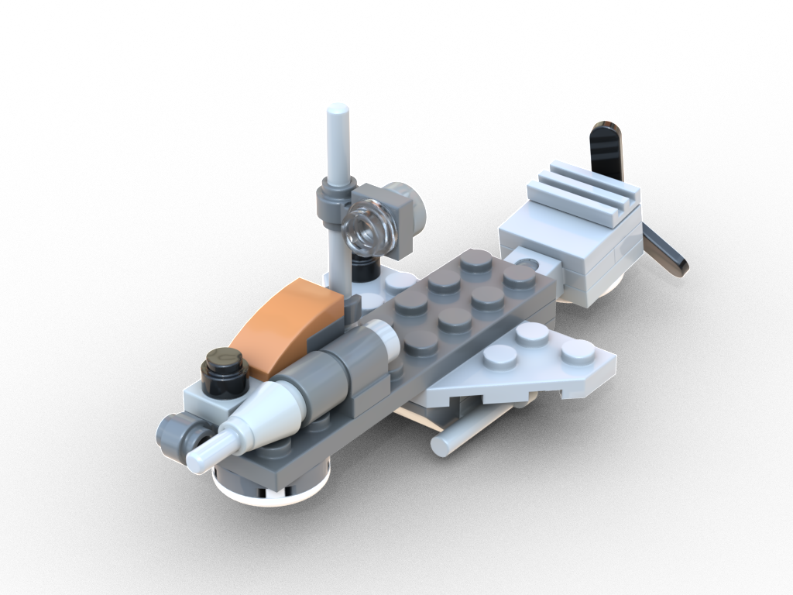
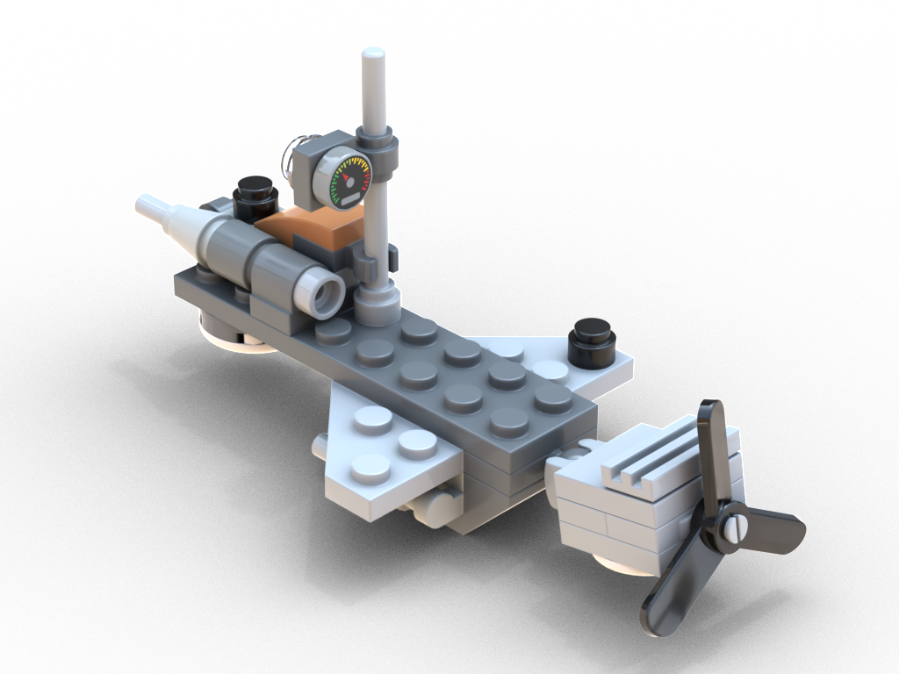
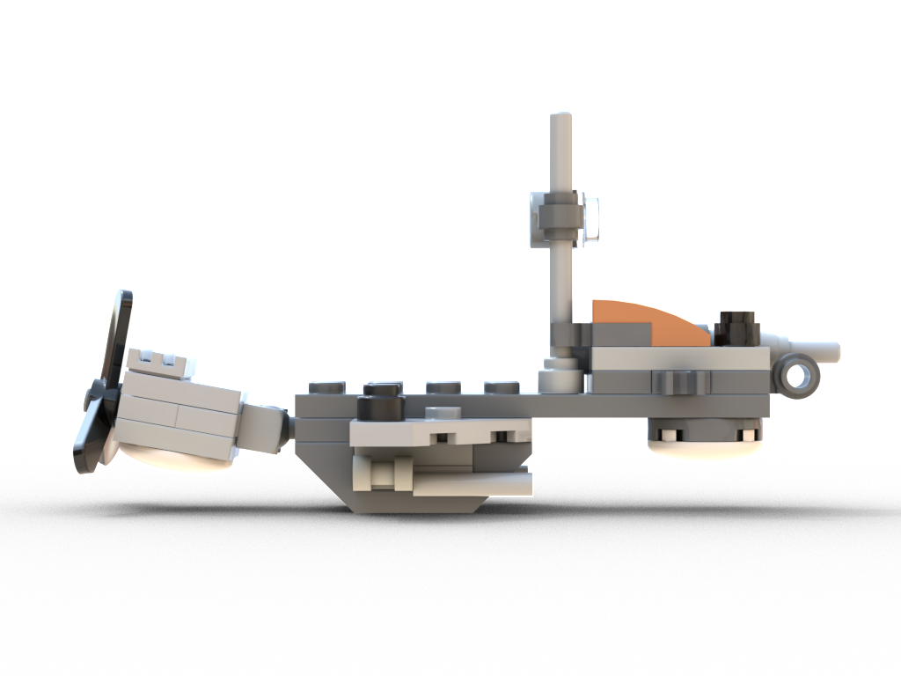
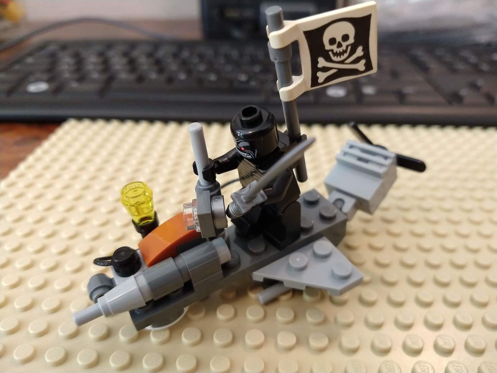
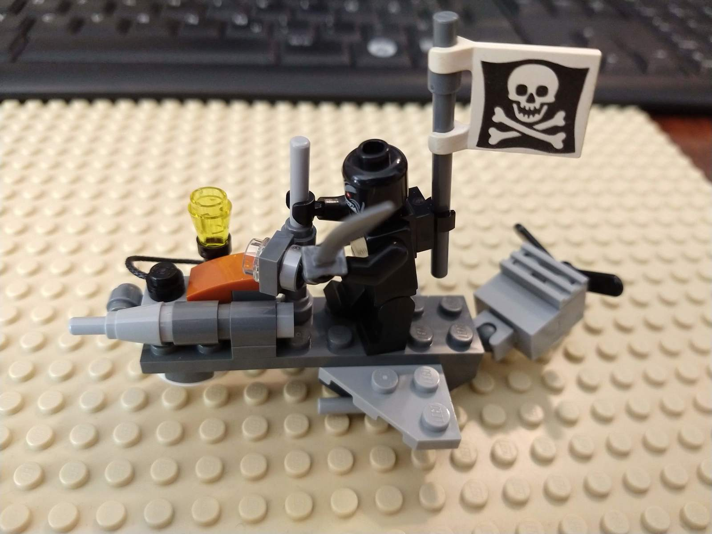

[Instructions (includes part list)](cloud-raider-instructions.pdf)

## Features

* Small pilot space with controls and a pole to hold on to
* Can haul a chest if the pilot is standing
* Adjustable engine
* Two slots to attach minifigure gear
* Front-facing cannon

## Meta

* Time needed to digitalize: ~20 minutes
* Dimensions: 11x5x5cm, 17g, 31 parts, 25 distinct parts

