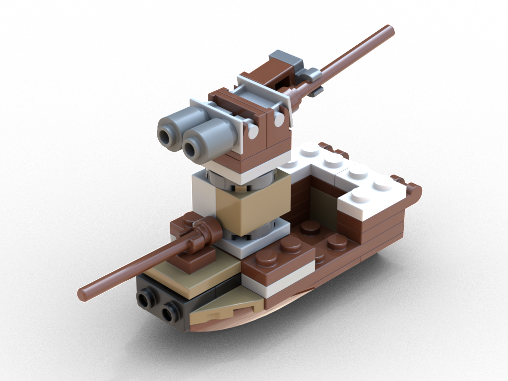
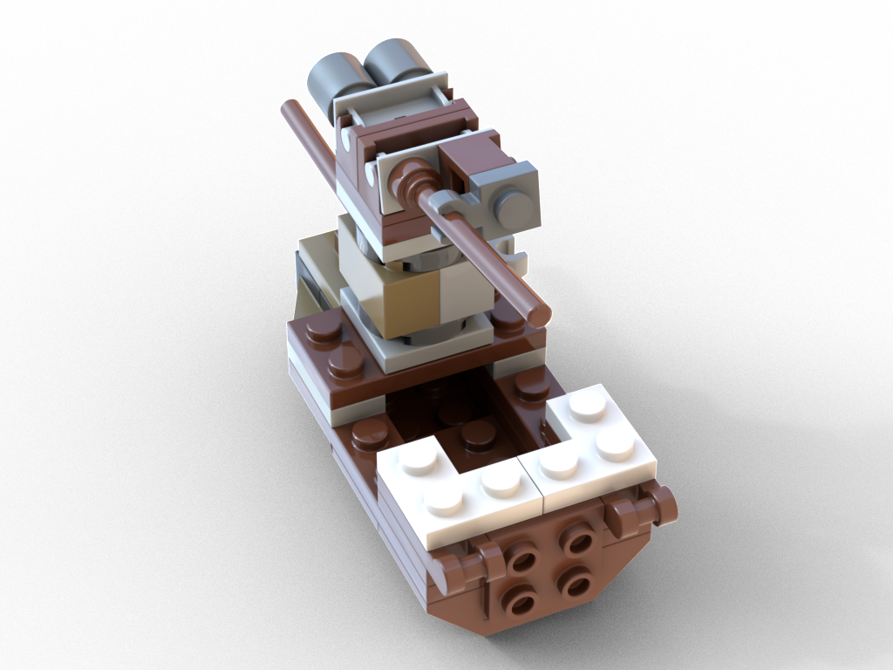
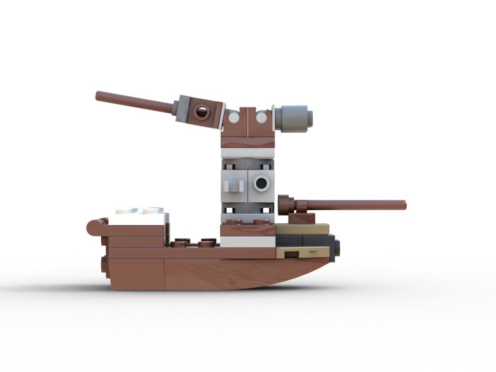
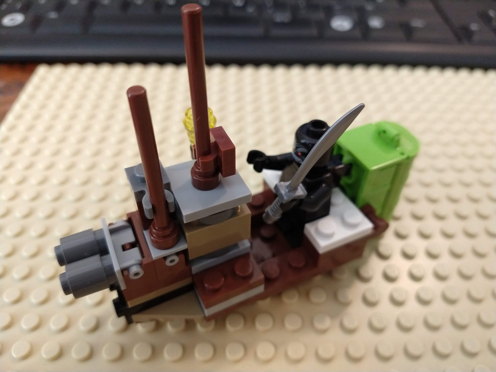
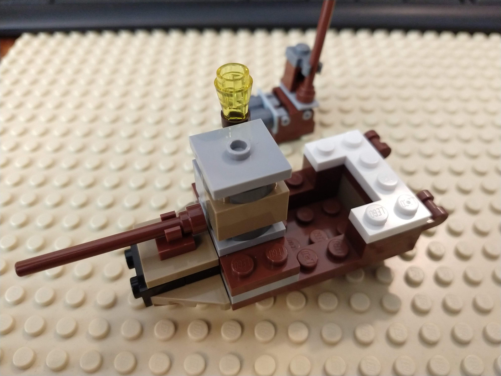
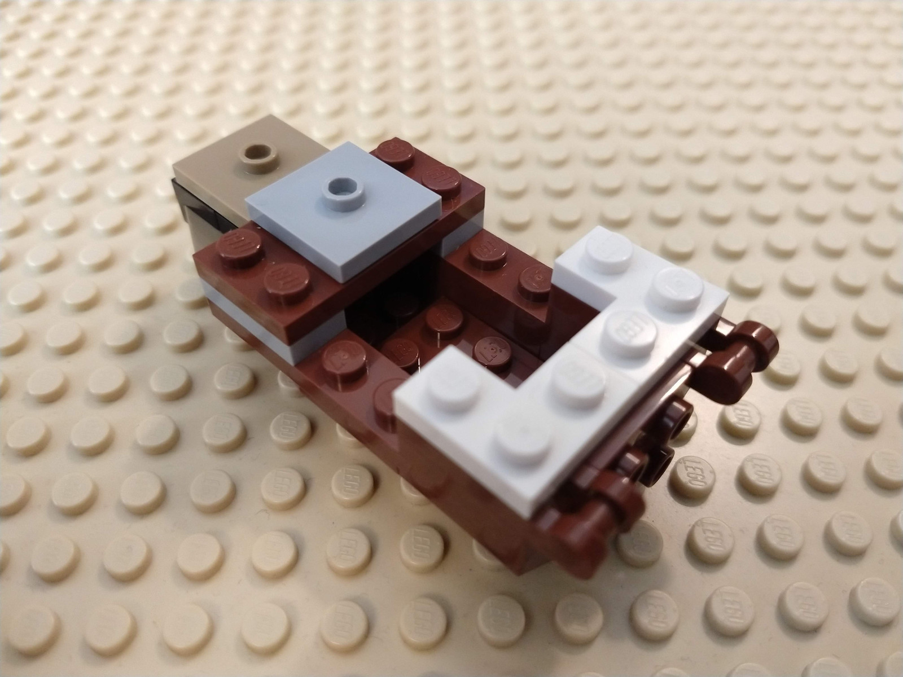

[Instructions (includes part list)](crafty-miniboat-instructions.pdf)

## Features

* Easily attachable/detachable front pole, mast with storage and mast with cannon
* Small skipper compartment
* Rear studs to store loot

## Meta

Inspired by Lego Minecraft sets using 2x2 modified plates with a stud in the center to easily attach/detach blocks.

* Time needed to digitalize the model: ~20 minutes
* Dimensions: 3x10x6cm, ~26g, 39 parts, 26 distinct parts

