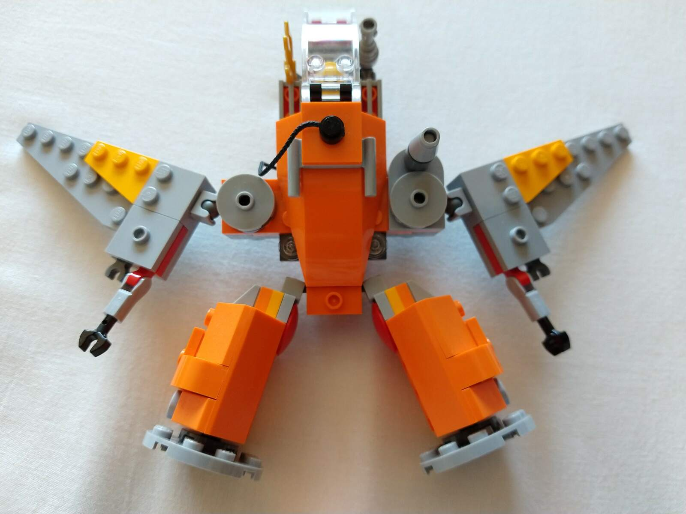
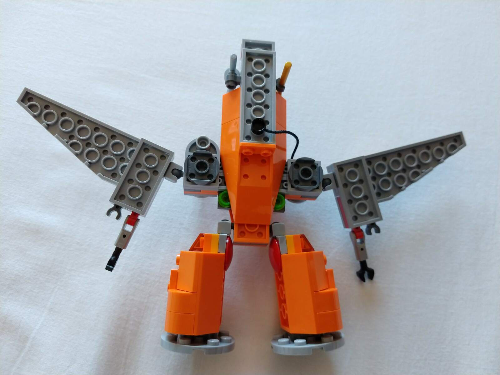
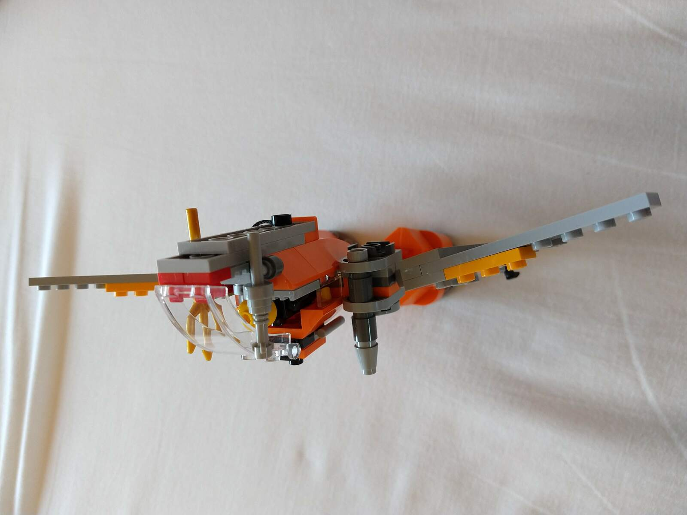
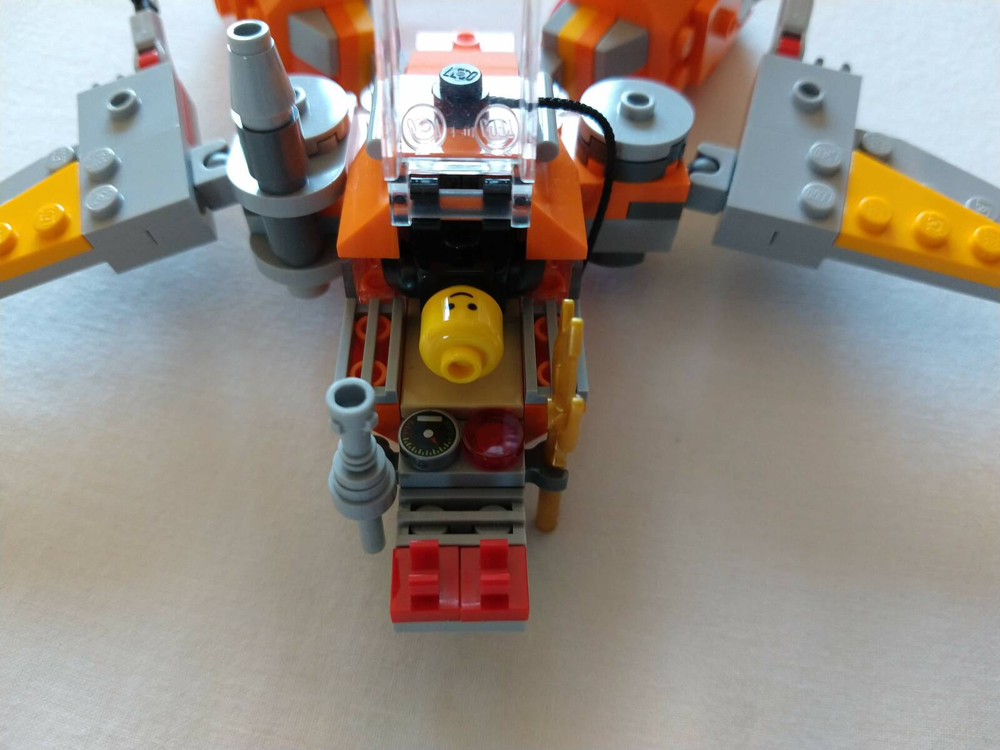

Mech with wings and wheels.

## Features

* Wings and legs can be folded, so that the mech "rolls" on its wheel "feet"
* Wings have "arms" with "hands" attached
* Not fully enclosed pilot space
* Cannon and harpoon
* Two engines
* Gear attachment points

## Photos

