# Lego Designs

My own Lego creations ("MOCs") with background information and instructions.

## Spaceships

[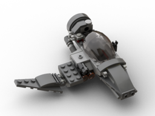](spaceships/the-mosquito/)
[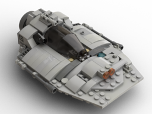](spaceships/the-wedge/)
[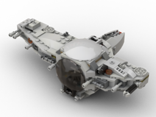](spaceships/universal-pod/)
[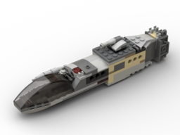](spaceships/the-needle/)
[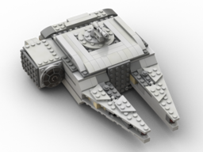](spaceships/the-square-falcon/)
[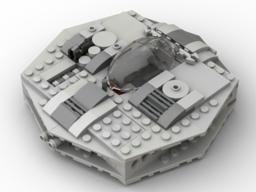](spaceships/saucer/)
[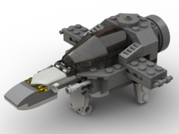](spaceships/the-dagger/)
[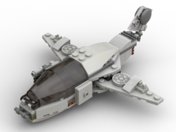](spaceships/the-swallow/)
[](spaceships/commuter/)
[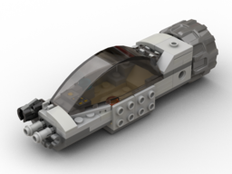](spaceships/combat-needle/)
[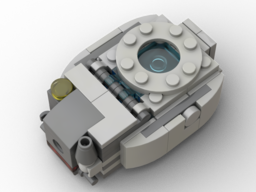](spaceships/personal-pod/)

* Triple Enforcer BT
* The Shiv

## Other Vehicles

[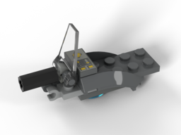](vehicles/hover-scooter/)

## Structures

* Biwak Pod

## 60th Anniversary Models

[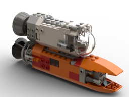](60th-anniversary/modular-rockets/)
[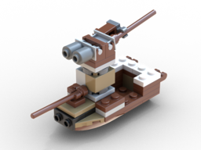](60th-anniversary/crafty-miniboat/)
[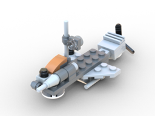](60th-anniversary/cloud-raider/)
[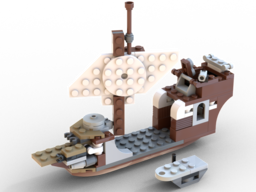](60th-anniversary/pirate-ship/)
[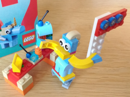](60th-anniversary/el-presidente/)
[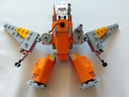](60th-anniversary/orange-mech/)
[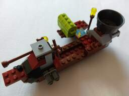](60th-anniversary/cannon-boat/)

## Alternative Builds and Modifications

[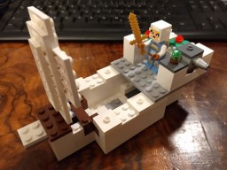](alts-mods/minecraft-ivory-ship/)
[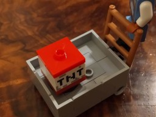](alts-mods/minecart-deluxe/)
[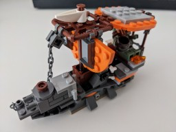](alts-mods/lava-sails/)
[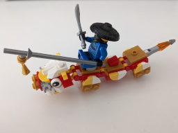](alts-mods/dragon-rider/)
[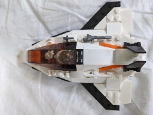](alts-mods/extended-ssm/)
[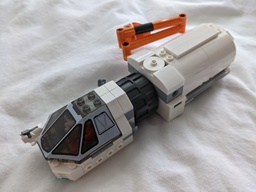](alts-mods/space-van/)

## Legacy

Models built only from old bricks:

* [Propeller Pirate Bike](legacy/pirate-bike/)
* [Cloud Gunner](legacy/cloud-gunner/)
* [Space Capsule](legacy/space-capsule/)

<!-- * [Junk Propeller Plane](legacy/junk-propeller/) -->

## Philosophy

*Fictive abstraction over realism*

* Playable, functional, robust and can be moved conveniently
* All designs are open for modification
* Greeble is an afterthought and does not compromise the above in favor of more visual appeal or detail
* Models for children, lore for adults

Design approach:

* Focus on core idea or moving, functional parts first (e.g. cockpit, hatches, engine, trapdoors)!
* Flesh out raw form!
* Improve sturdiness!
* Iterate!

## Tools

All models are digitalized using [BrickLink Studio](https://studio.bricklink.com/v2/build/studio.page).

**Make sure to save regularly, since the software sometimes crashes under wine when making instructions!**

Resize model photos:

```
mogrify -resize 1600 *.jpg
```

Resize thumbnails:

```
mogrify -resize 256 *.png
```

* Thumbnails are in 4:3 format, 256x192 px

Rendering settings:

* 1024x768 size, "High" quality
* "Transparent" background, "Floor shadow" enabled
* Light: "Asteroid" (spaceships), "Dawn" (ship, atmospheric vehicles)
* Material effects:
    * "UV Degradation" on, Min. `0.15`, Max. `0.5`
    * other effects off
