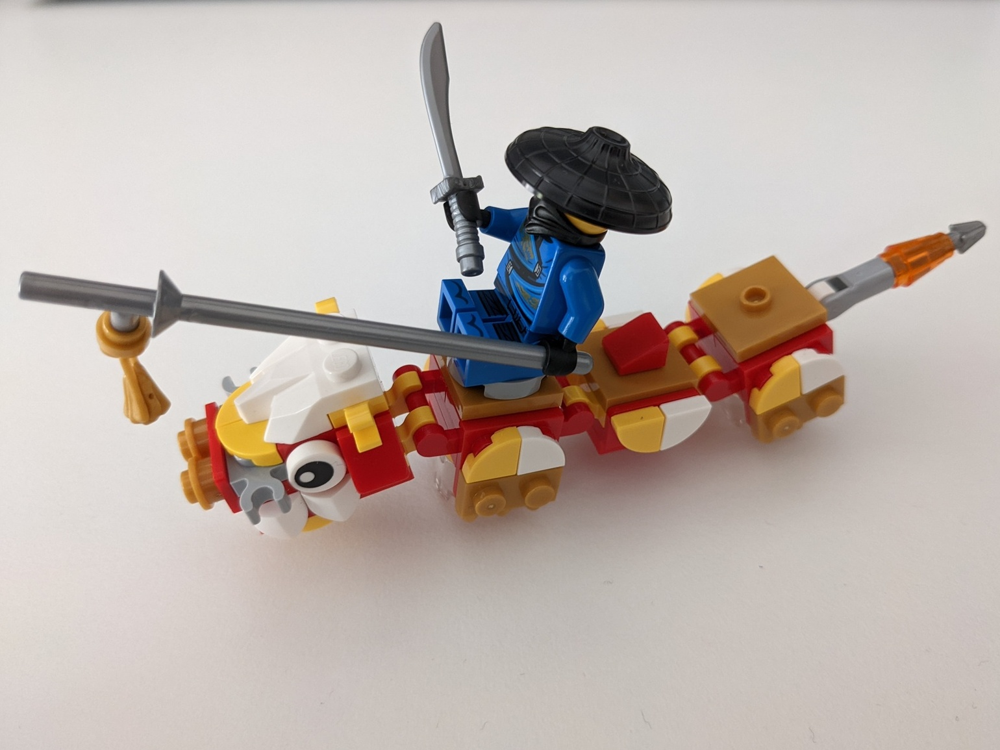
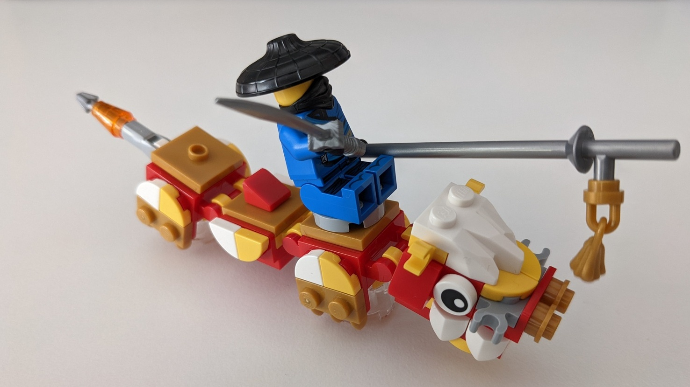
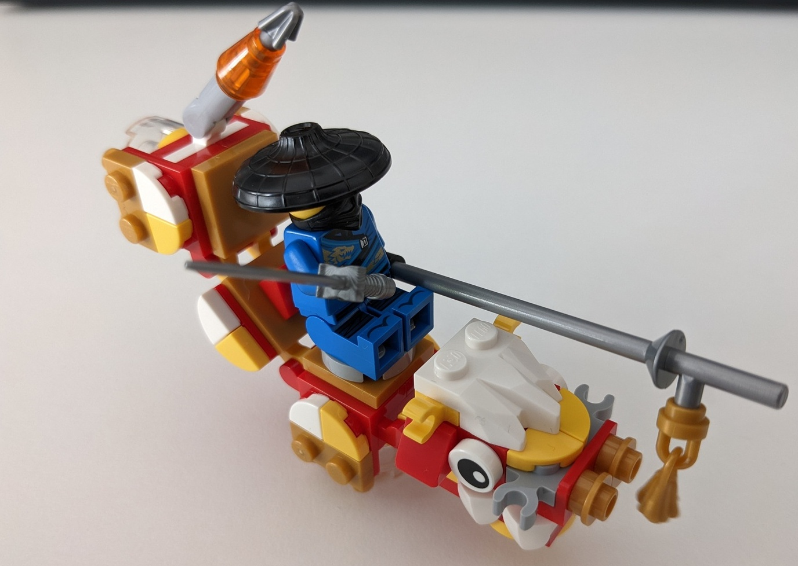
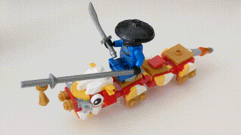

Alt build for [40395](https://www.bricklink.com/catalogItemInv.asp?S=40395-1), mixed with some minor Ninjago sets like [30537](https://www.bricklink.com/catalogItemInv.asp?S=30537-1) and [70671](https://www.bricklink.com/catalogItemInv.asp?S=70671-1).

## Features

* Less flimsy than the original dragon model
* Dragon rider with "carrot on a stick", rider is optional and seat is easily removed
* Dragon looks a bit older than the original model, more white/gray
* Dragon has more gear attachment points and a different rear spike
* Makes for a nice desk decoration, can be pushed to wobble

## Photos

