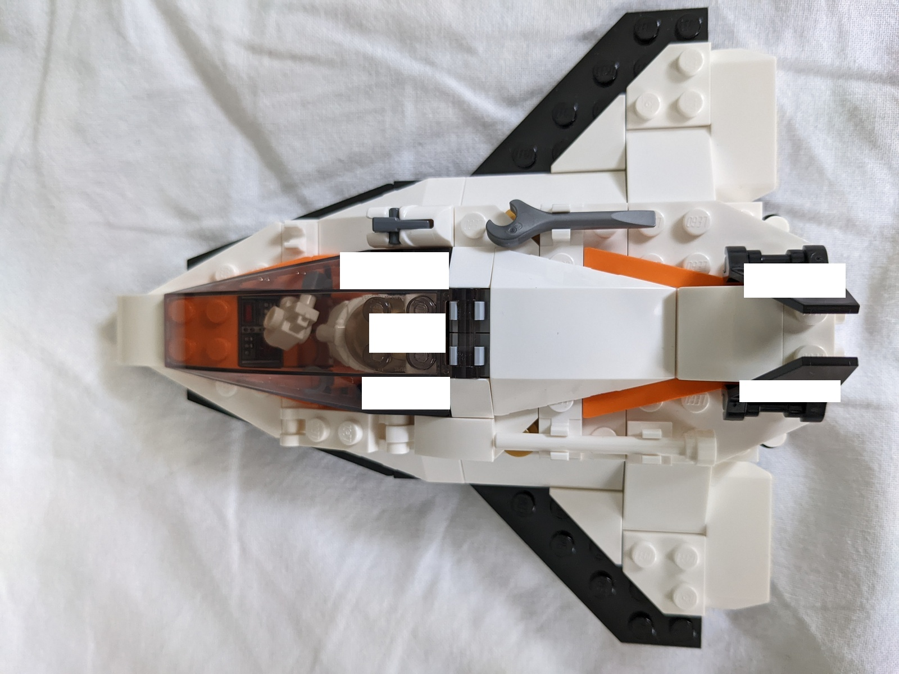
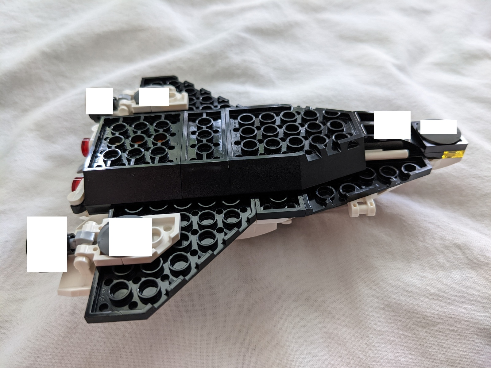
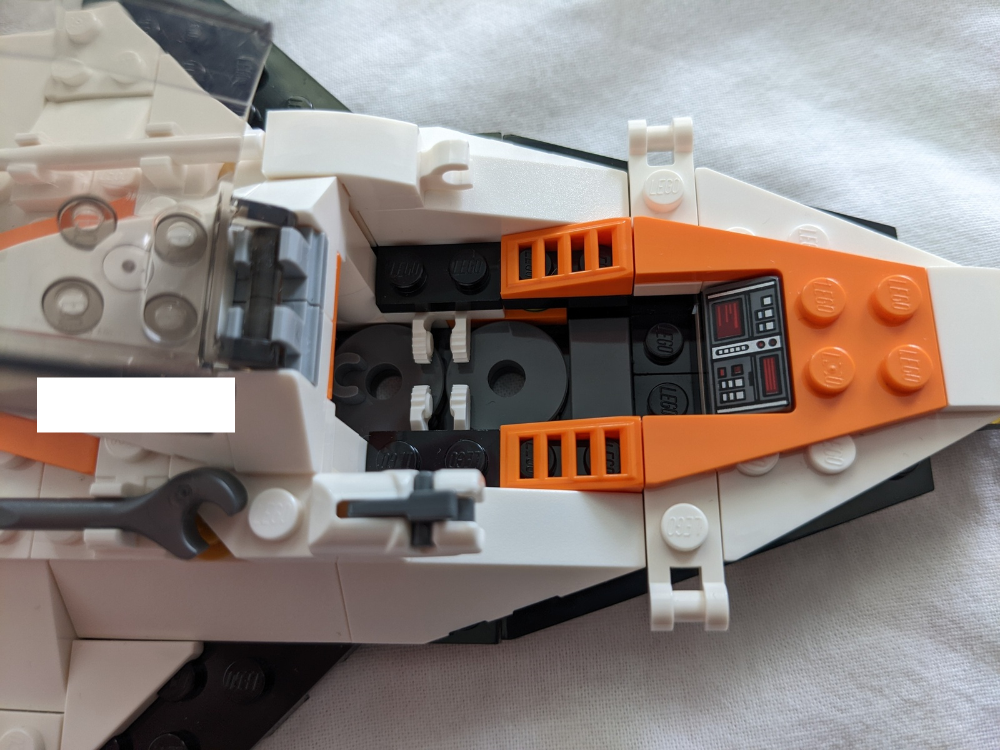
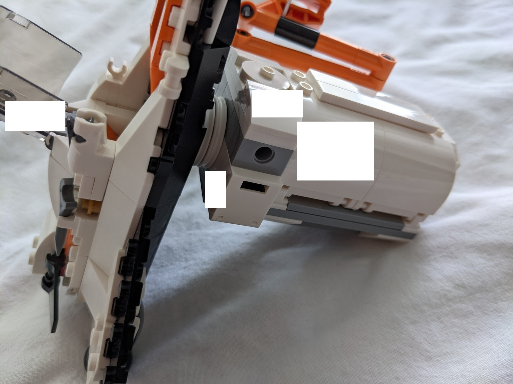
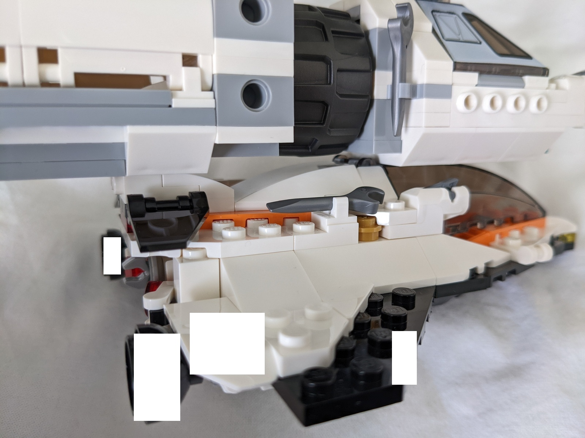
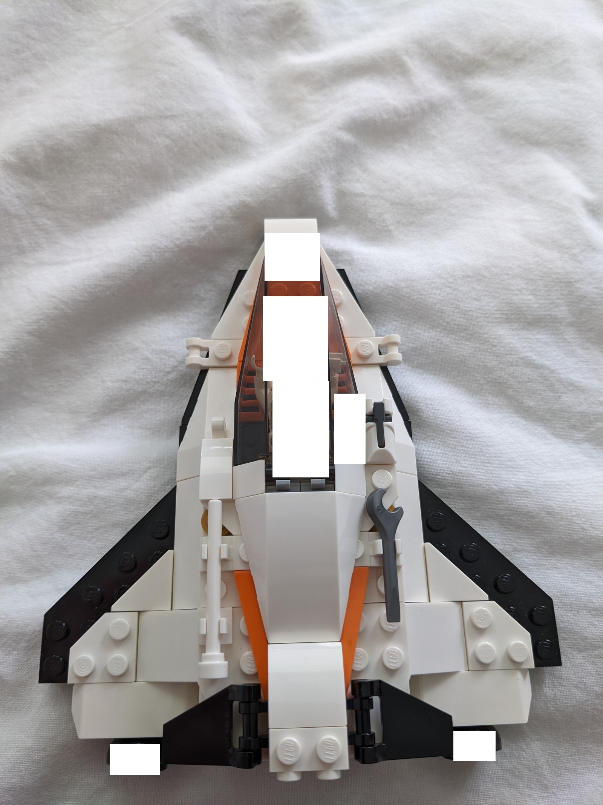
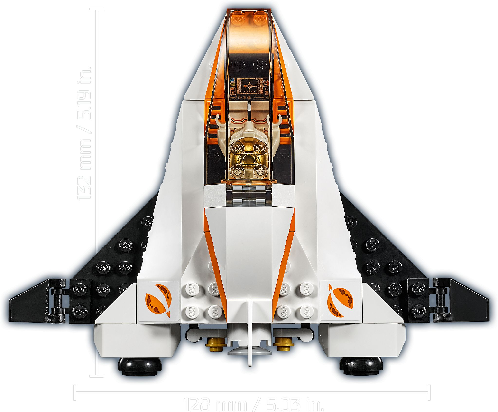

Super-charged version of [60224 Satellite Service Mission](https://www.bricklink.com/catalogItemInv.asp?S=60224-1) from 2019.
While the original set is prob. the best 10 EUR set of 2019, I still iterated on it.
Resulting in a less round, more square, more robust look:

* Longer nose with light
* More gear attachment points
* "Rocket launcher"
* Bottom docking port
* Extended rear storage, window to rear storage from pilot seat
* Foldable wings are centered and moved up, replacing the flimsy yaw rudder. Onto the studs, additional cargo can be placed

## Photos

## Meta

(For comparision, official promo shot of the original model by Lego)

* I only made the model 2 studs longer recently, works with and without
* Same with the 2x1 white filler tiles (modified) on the cockpit sides, which can be varied to preference
* Works with and without the standard turbine exhausts. Turbine exhausts can be made more robust by applying 1x1 round plates with rod hole included in the set
* The bottom docking port is one the most over-engineered pieces I ever come up with
