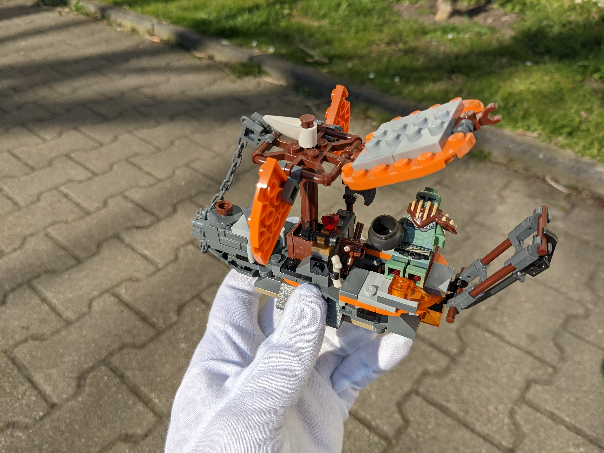
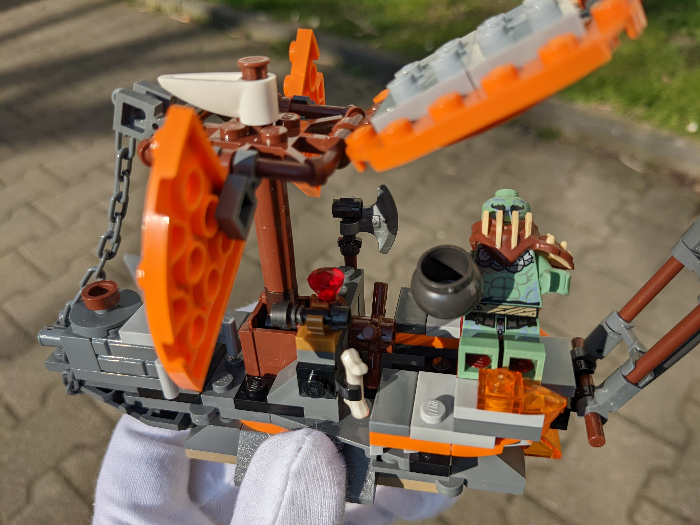
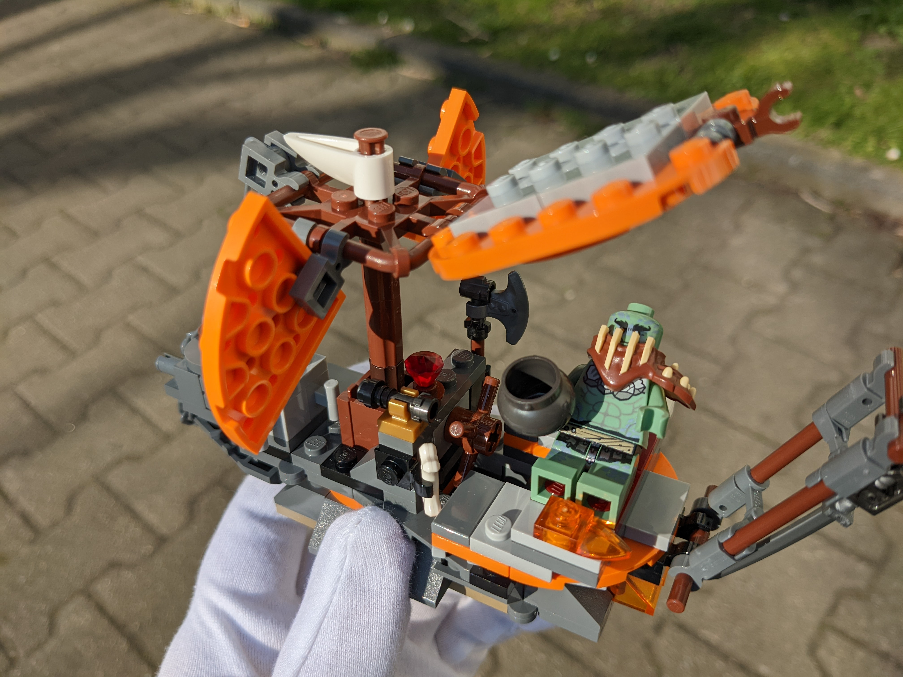

Alt build to [Lego 71717](https://www.bricklink.com/v2/catalog/catalogitem.page?S=71717-1) from 2020.

Small little ship for one Orc. Powered by a stream of hot lava. WOOOOSH!

## Features

* Front cannon which can be folded to the left side, to shoot moving targets
* Ramp, which can be folded to the right side, e.g. for docking in ports
* When both are folded, the ship's bow can be lifted up, serving as a shield for impact
* Storage space for various equipment and loot, e.g. bone snack, a ruby, spyglass, battle axe, cooking pot and bed
* Sails can be folded into various positions
* Roof/sun protection can be folded upwards
* Rear sword

## Photos

## Meta

* Why is Mark Zuckerberg's wife cutting his hair? Seems like a huge waste of high-paid people's time!
* (Well, my GF and I did the same earlier and during lockdown, saves money, and we never liked going to hairdressers anyway)
*

