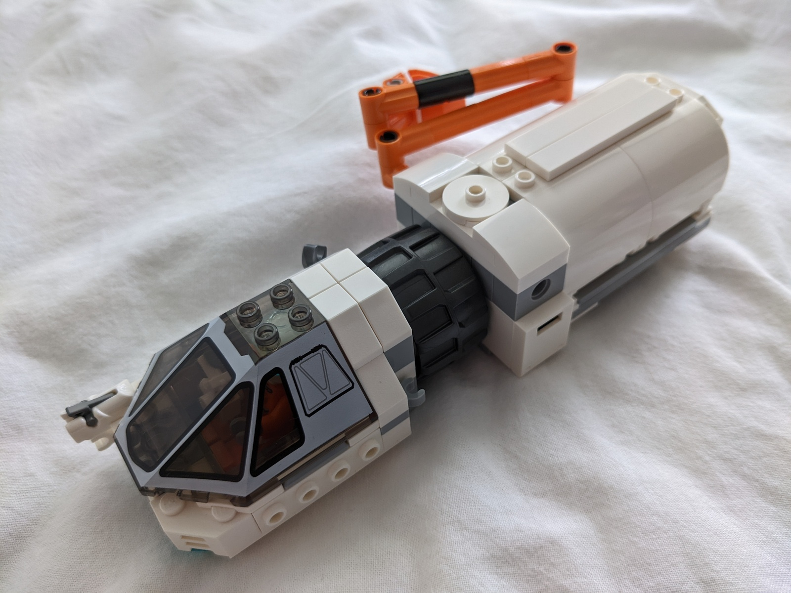

Alt build mostly from parts of [60225](https://www.bricklink.com/catalogItemInv.asp?S=60225-1) and [31066](https://www.bricklink.com/catalogItemInv.asp?S=31066-1). The capsule is heavily inspired by the rover, but turned into a spacecraft of its own.

## Features

* Capsule and cargo bay can be separated
* Spacious pilot compartment
* Multiple gear attachment points
* Multiple docking ports
* Lots of space in the docked rear part

## Photos

## Meta

* The only thing I'm not satisfied with is the lacking rear engine design for the full space van model
* The capsule itself is the best part and the "van attachment" is designed more like a nice-to-have

