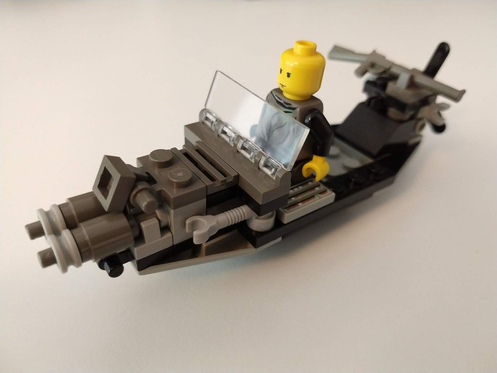
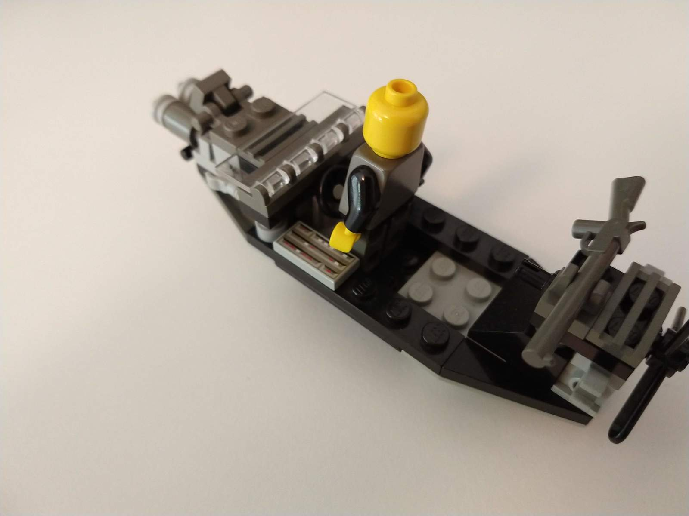
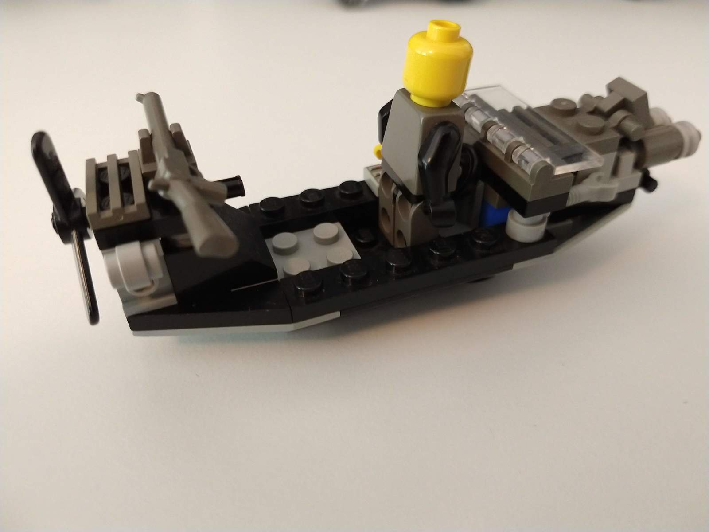
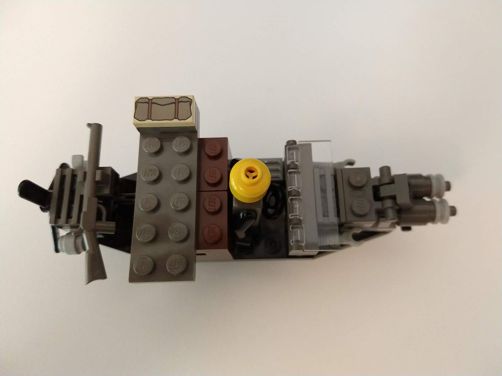

One of my oldest, still-assembled models.
Small adventure-style, propeller-powered cannon boat with windshield, helm and plenty of attachment points (incl. extendable arms).
The black 2x2 sloped brick in the rear is usually a cockpit/gauge slope I temporarily used for another model.
The dinghy is lifted up at the front by a boat stud which gives it a realistic float.

