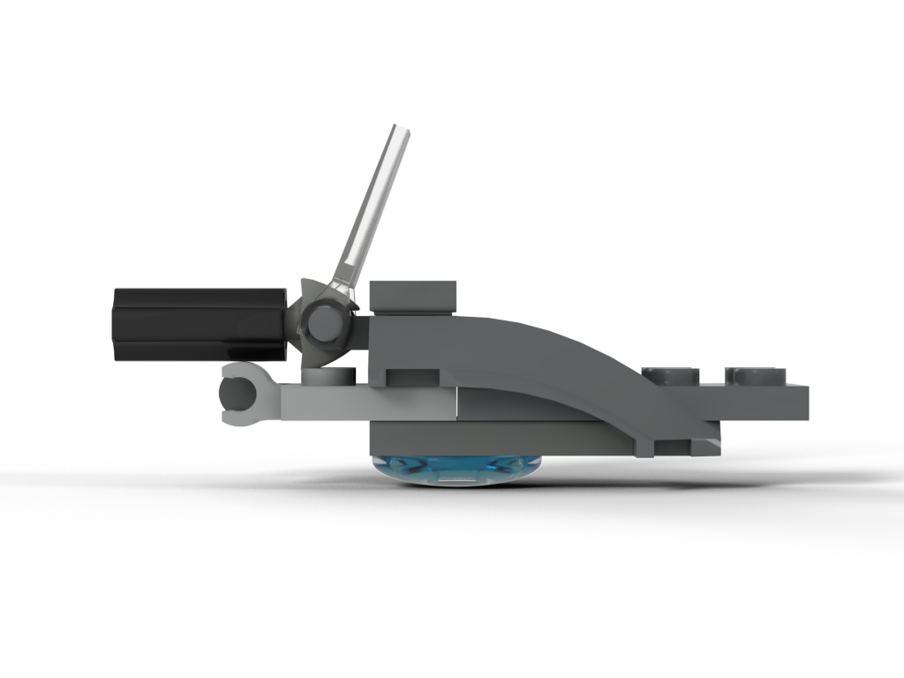
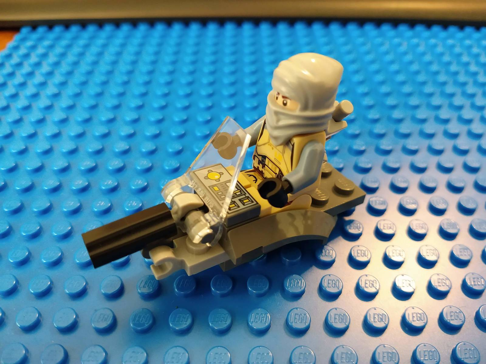
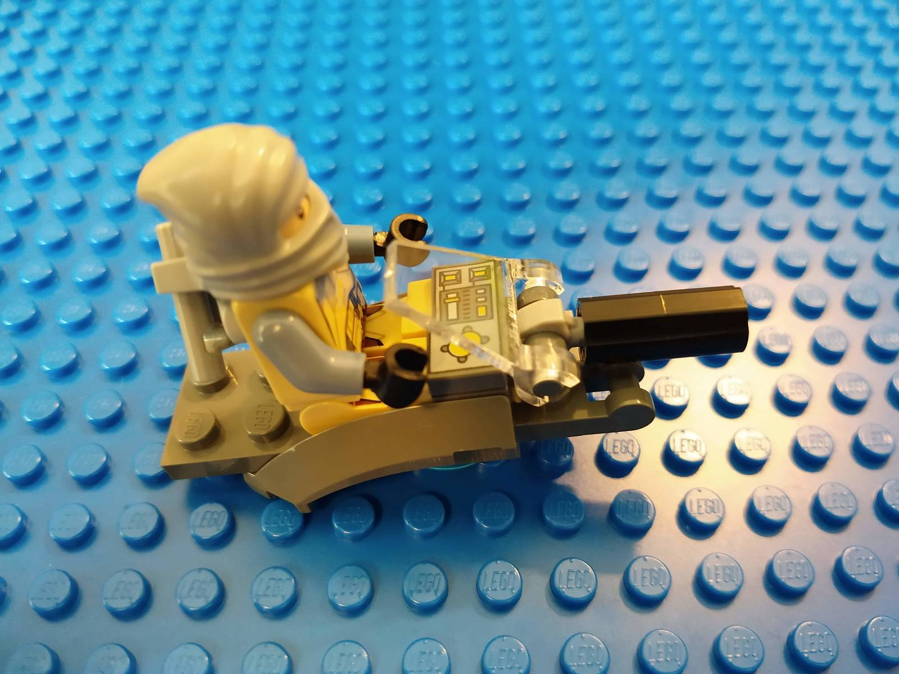

Small scooter for up to 2 minifigures. With controls, windshield, 2 gear attachment points and a cannon that can also hold a pole.

[Instructions (includes part list)](hover-scooter-instructions.pdf)

## Rendered images

## Meta

I struggled for a long time, trying to build a machine around the special wedge part with a cut-out. So I tried to create a minimal playable design. The boat stud twiddles nicely with the center of mass, yielding interesting/shaky ride behavior.

* Time needed to digitalize: ~10 minutes
* Dimensions: 6.5x2.5x3.5cm, 7g, 11 parts

