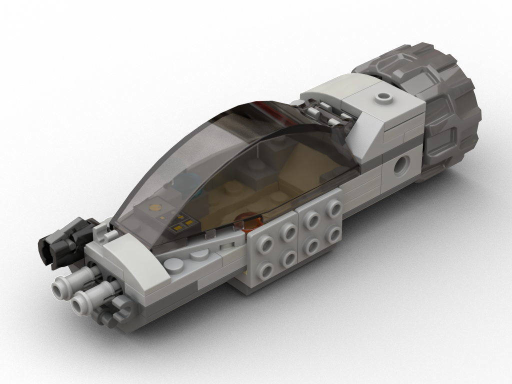
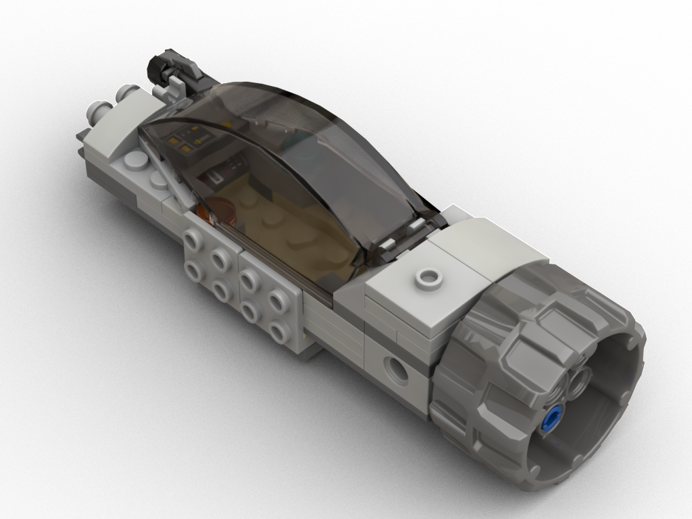
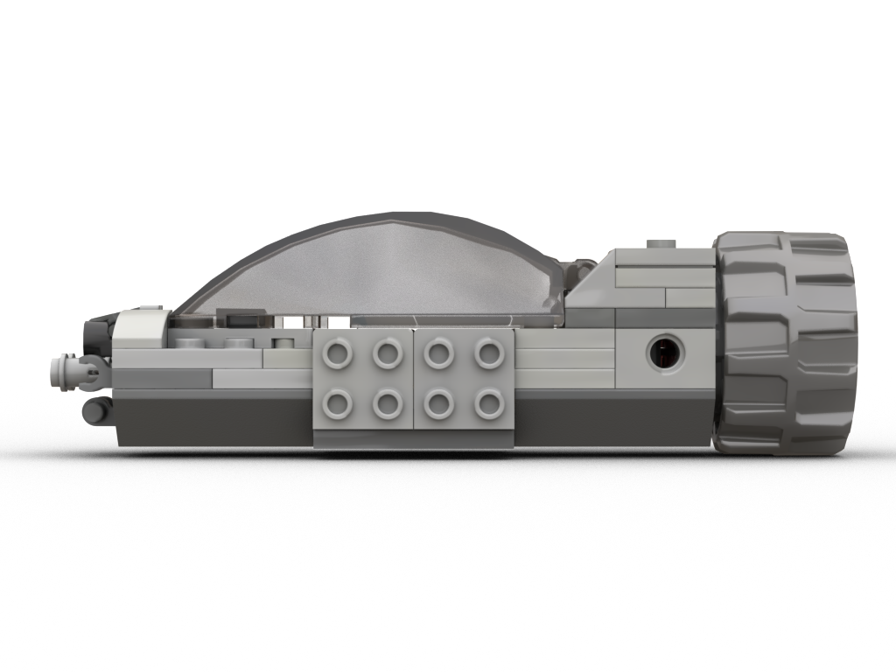
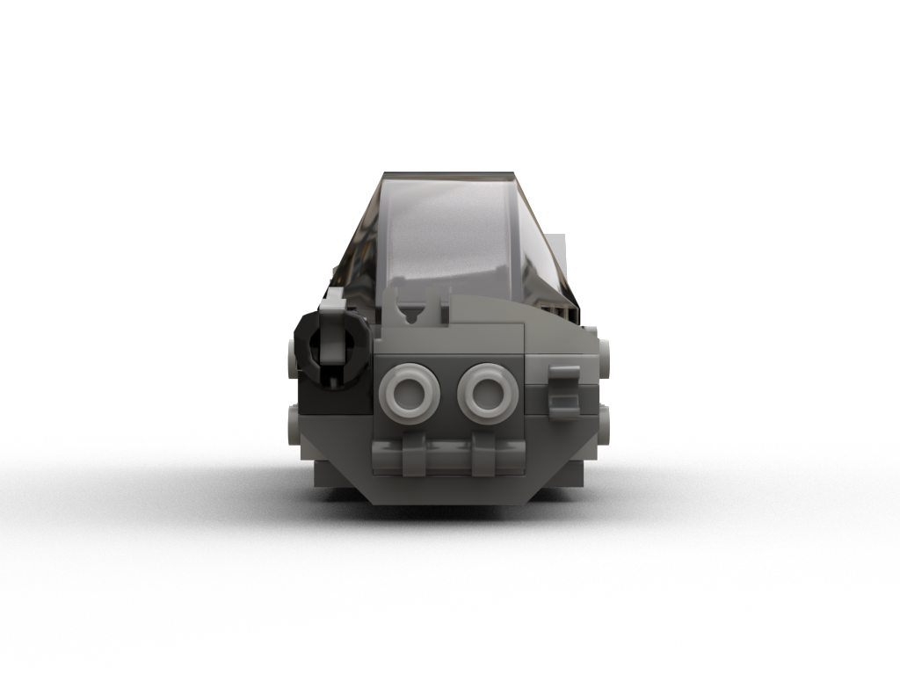
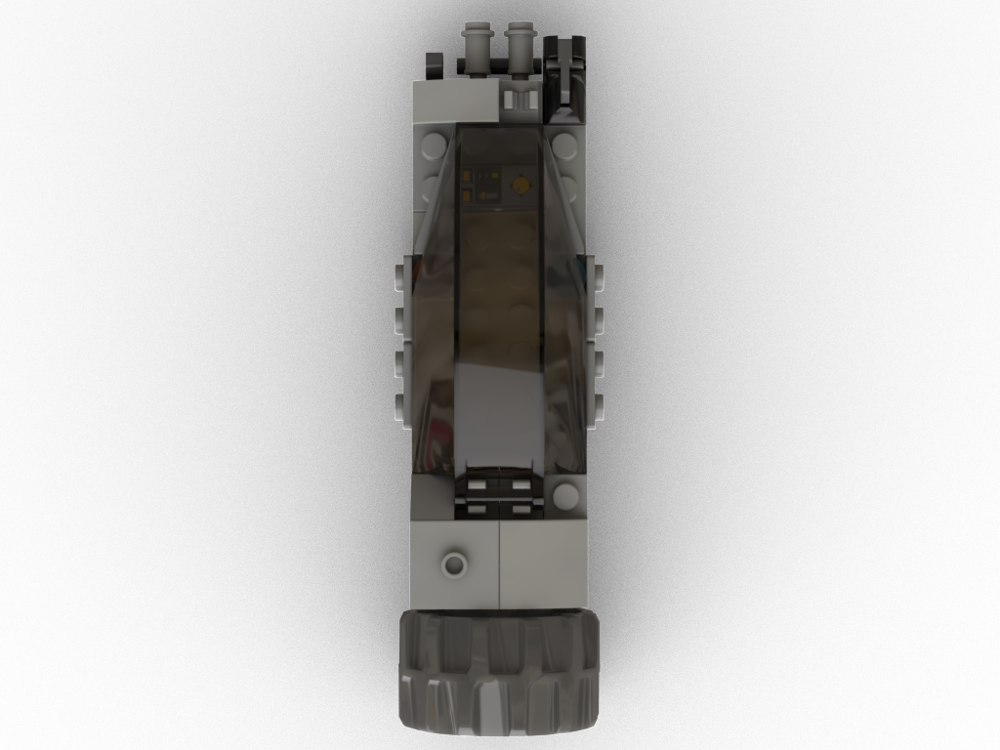

# Combat Needle

[The Needle](../the-needle/) with improved combat capabilities, better pilot comfort and cargo/armor attachment points.

[Instructions (includes part list)](combat-needle-instructions.pdf)

## Rendered images

## Features

* Spacious cockpit for pilot comfort
* Droid/light cargo docking port
* Rear engine can be detached and replaced with various other engines
* One pin connector per side for extension
* Two laser cannons, one missile launcher and further attachment points in the front (minifigure gear or instruments)
* 2x4 stud connectors on each side to attach cargo or further armor plates

## Meta

The front part with weaponry and sensors was inspired by assault helicopters. Its asymmetry is supposed to mirror and balance the rear asymmetry inspired by [The Needle](../the-needle/).

* Dimensions: ???x???x???cm, ???g, ??? parts, ??? distinct parts

