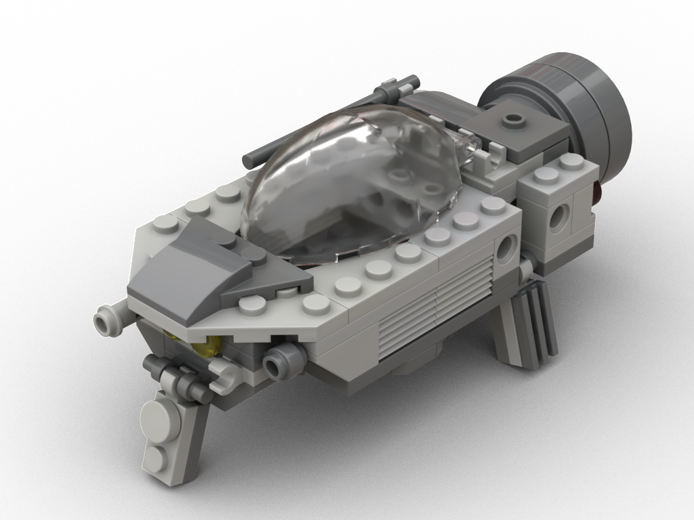
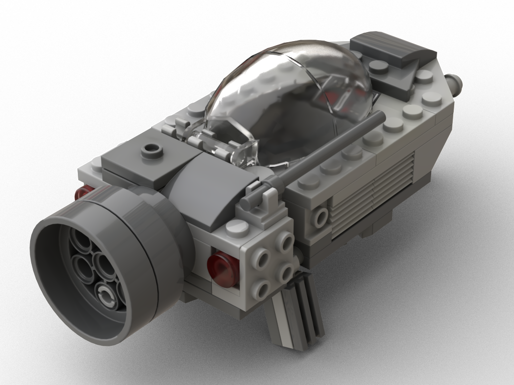
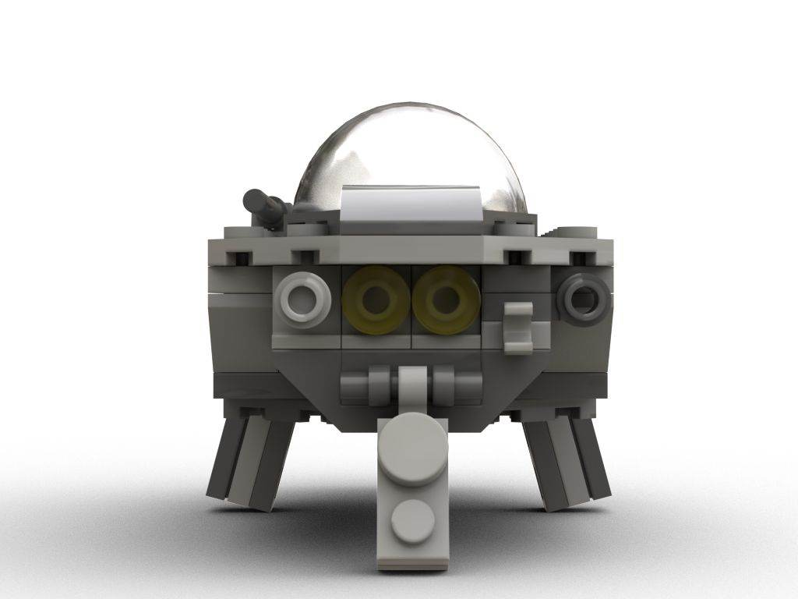
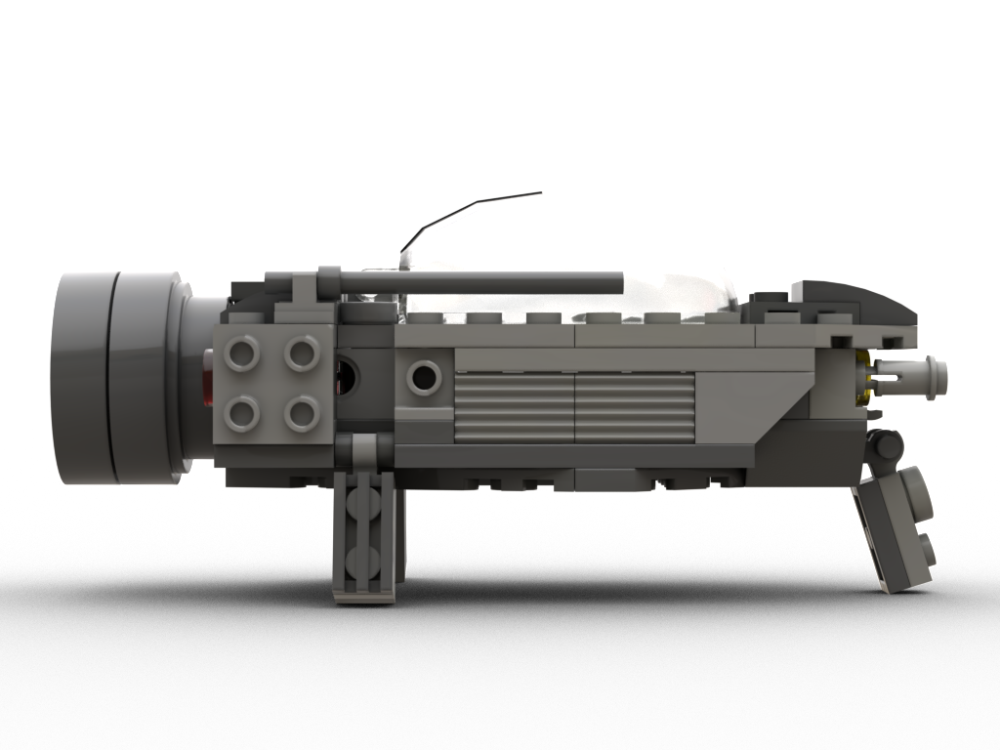
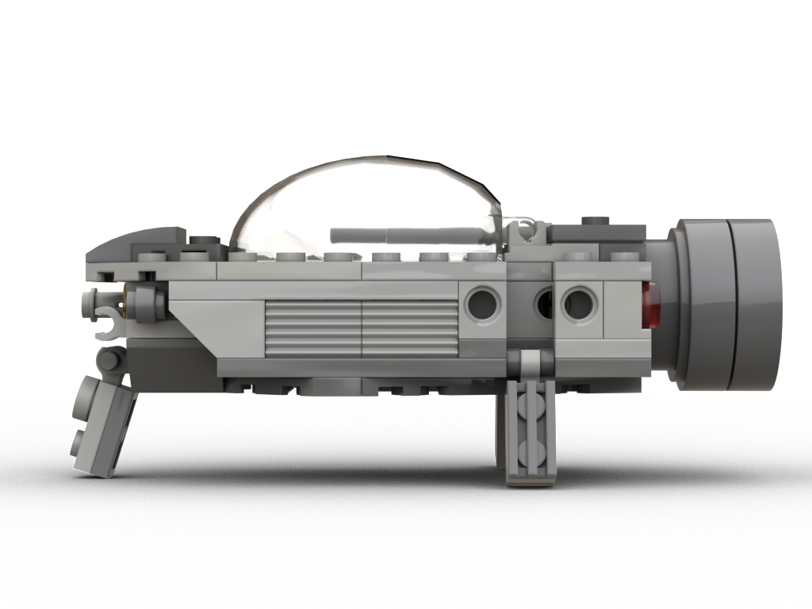
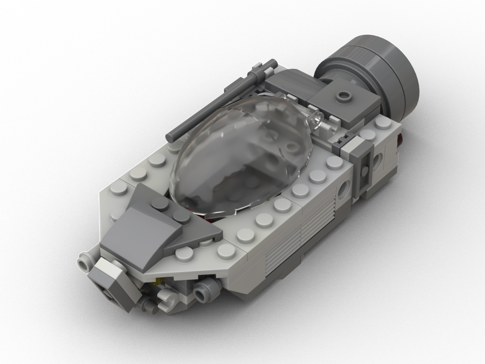
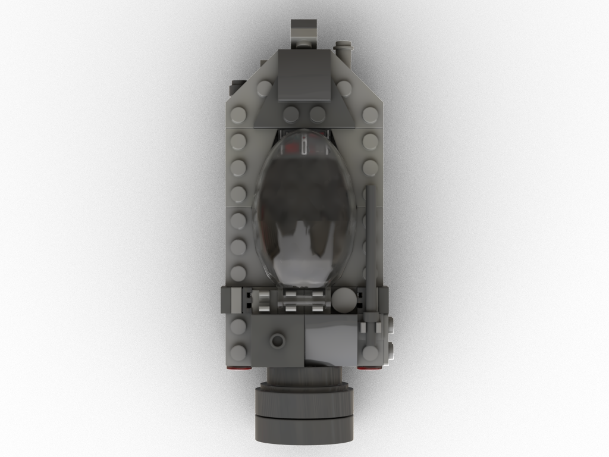
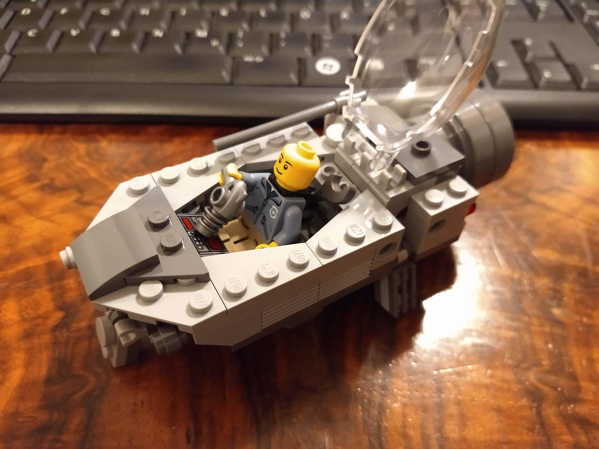
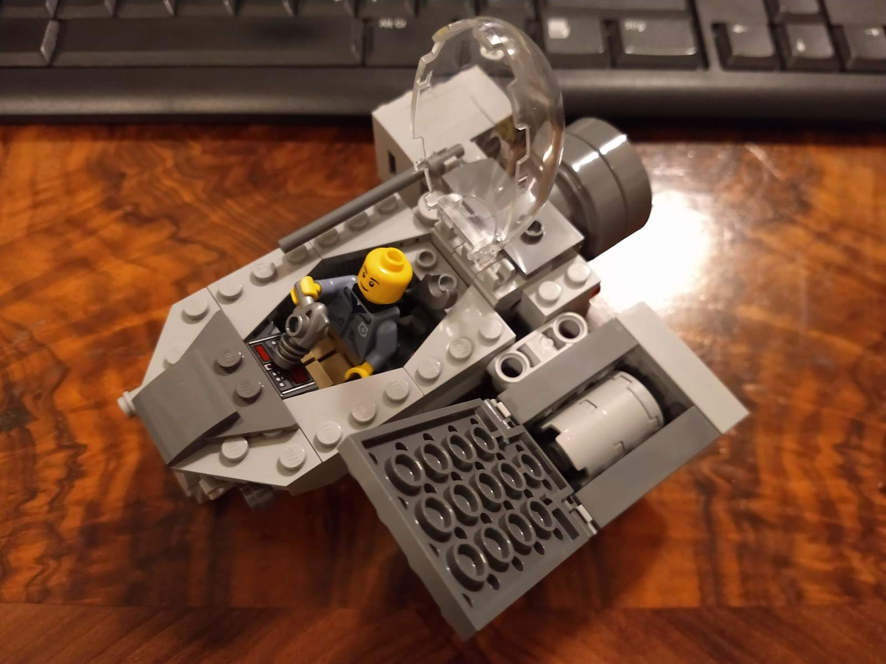

# Commuter

The Good Industries "Commuter" carries the average office worker to the job and back home again. Remote work is no option for space-scale businesses!

[Instructions (includes part list)](commuter-instructions.pdf)

## Rendered images

## Features

* Spacious cockpit
* Equipment storage clips
* Droid docking port
* Connection and dock ports for various container types
* Rear connection allows for different engines to be attached
* Light laser gun
* Extendable pedestals
* Can stand/start upright on its engine

## Meta

I liked the cockpit of the [Saucer](../saucer/) so much, I wanted to reuse it for a smaller ship. The design is inspired by retro sci-fi "flying cars".

* Time needed to digitalize: ~20 minutes
* Dimensions: 13x6x6cm (with pedestals extended), 67g, 91 parts, 49 distinct parts

