The Personal Pod was originally designed as an escape pod.
Due to high energy efficiency it is also advertised for personal travel between bigger spaceships.
Visual similarities with sarcophagi are just coincidences.

[Instructions (includes part list)](personal-pod-instructions.pdf)

## Rendered images

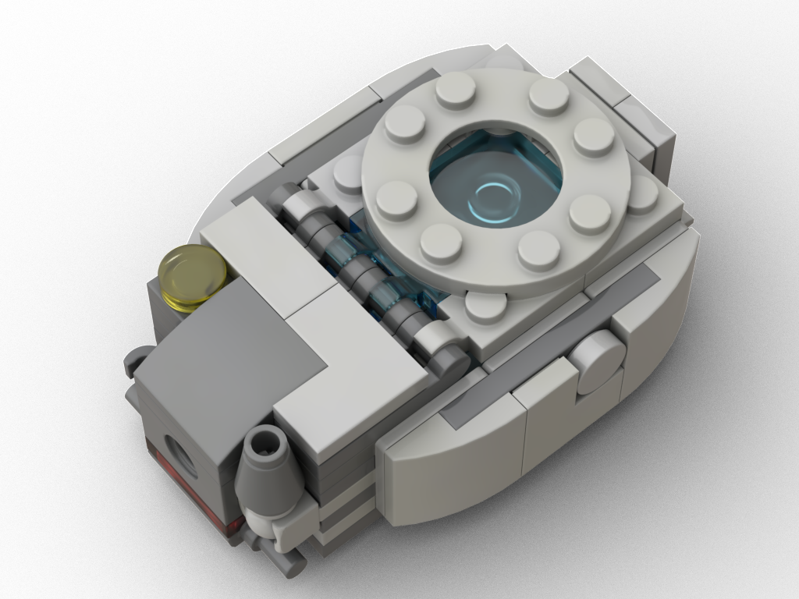
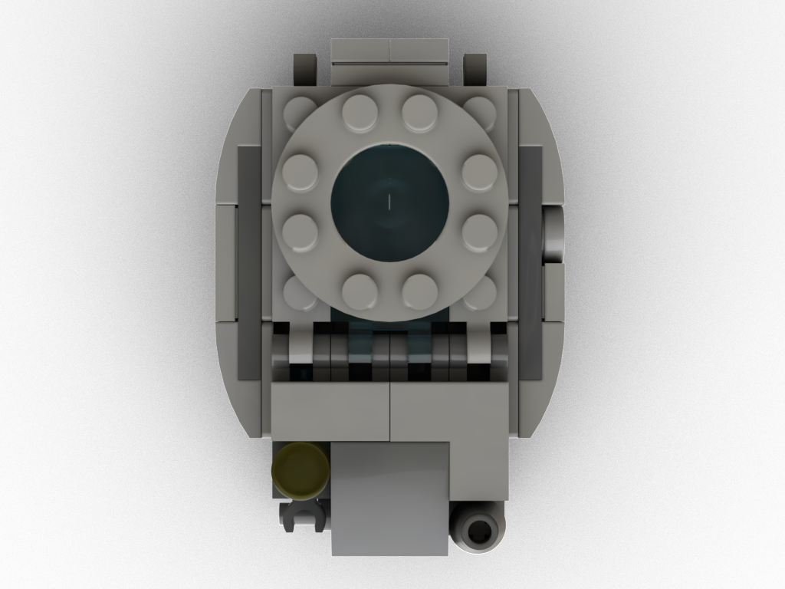
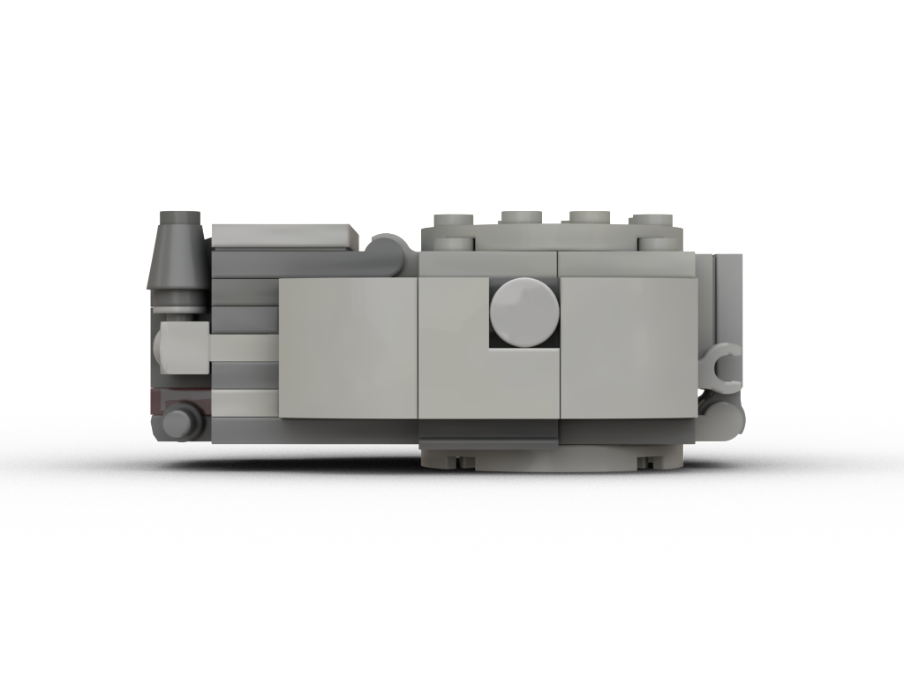

## Features

* Small size pod for one minifigure incl. minor equipment
* Various outside attachment points
* One cannon, one headlamp
* Three movable cockpit hatches
* Daisy-chainable using top hatch
* Top hatch can also fit a bot
* Bottom attachment point for further engine or utility
* Blocky edges allow for various "slide-in" options as escape pod for bigger vessels

## Meta

* Dimensions: 7x5x3cm, 39g, 72 parts, 37 distinct parts

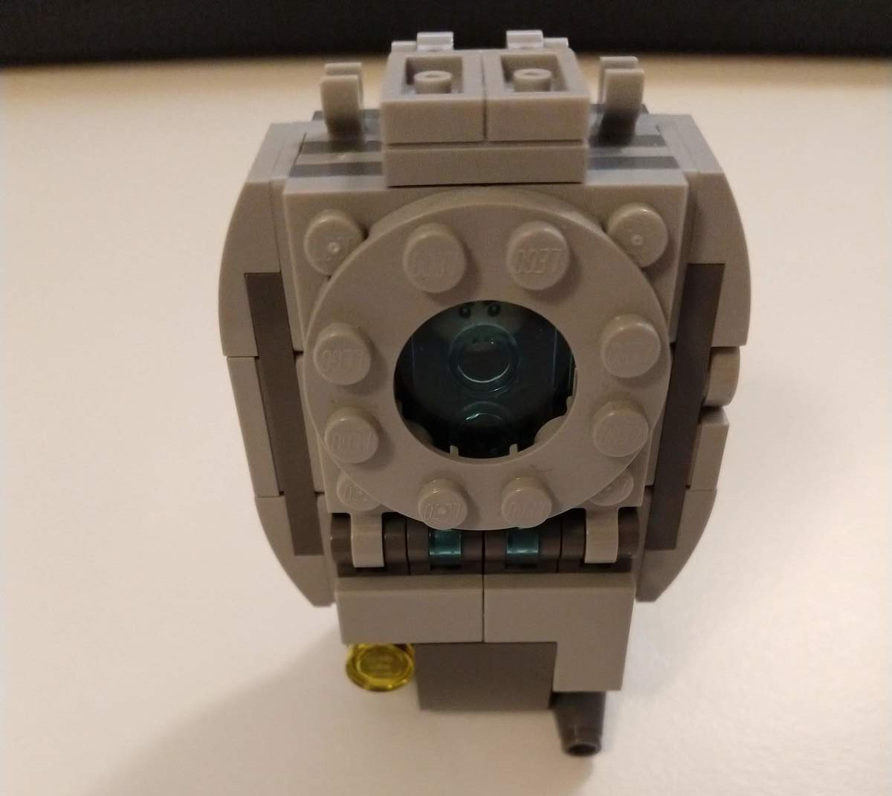
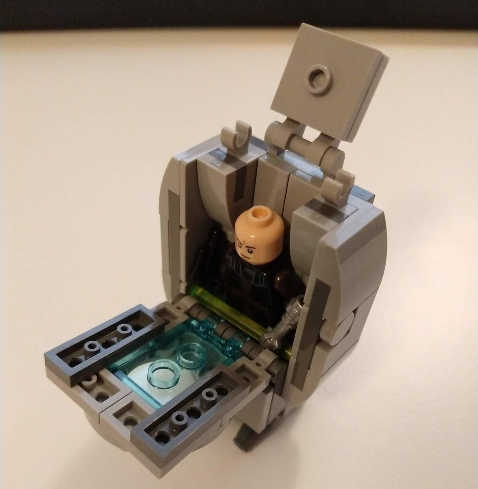
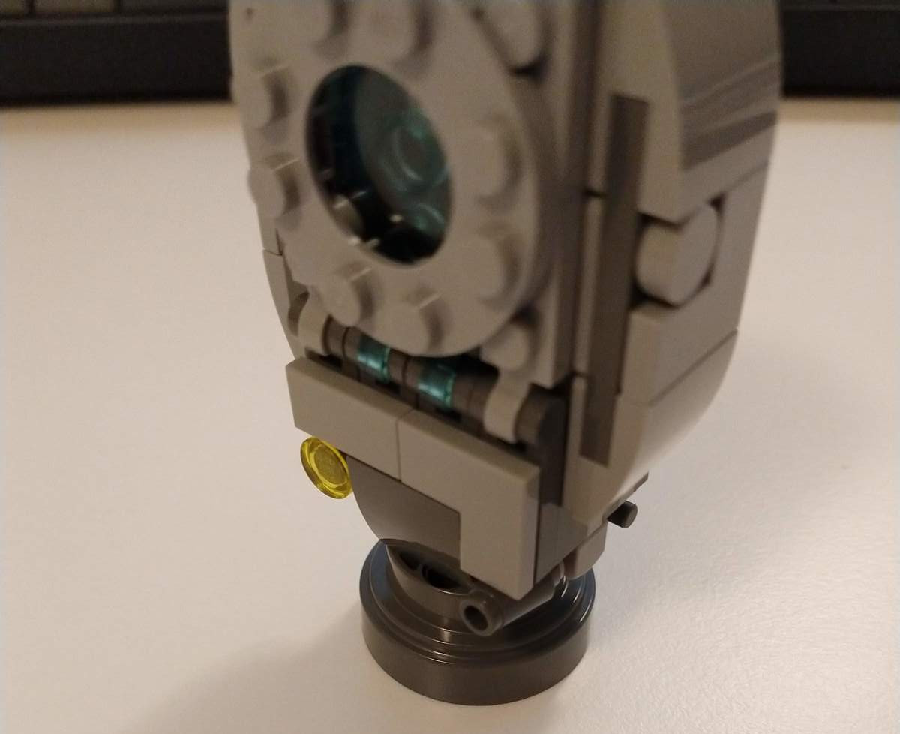
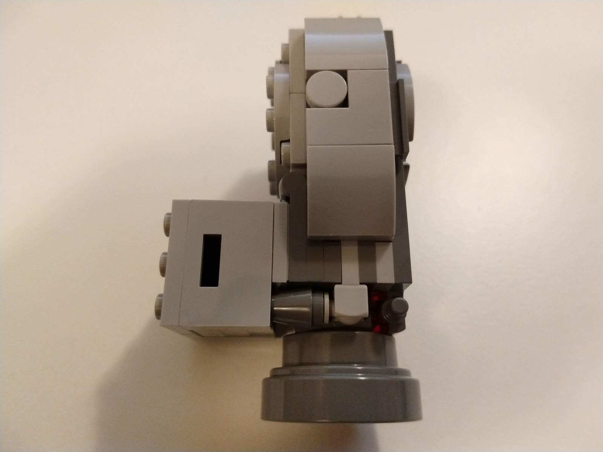
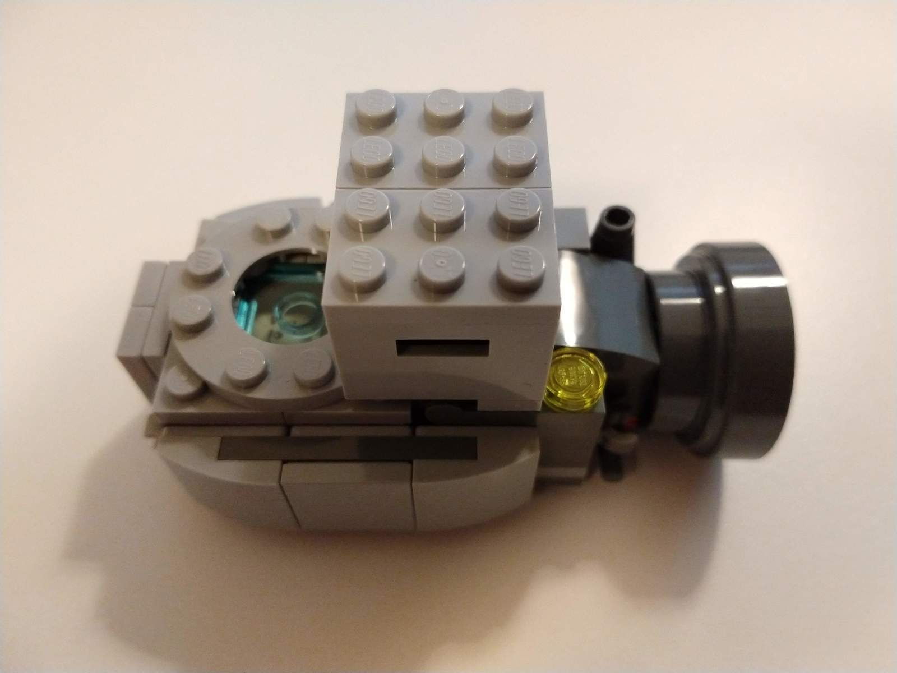
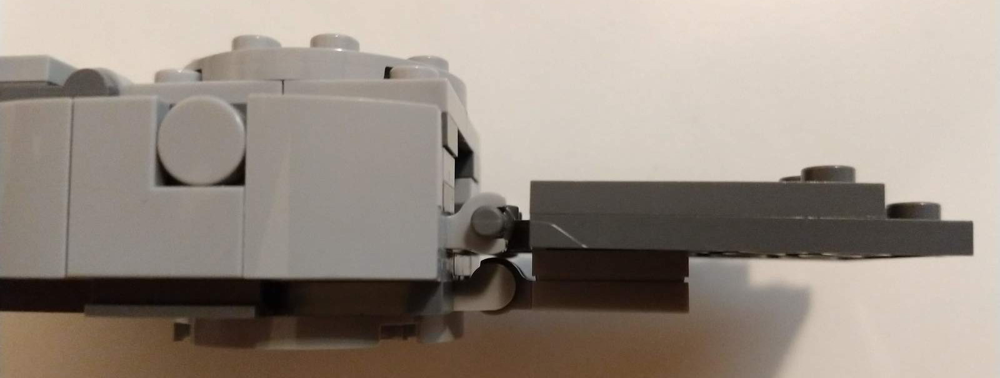
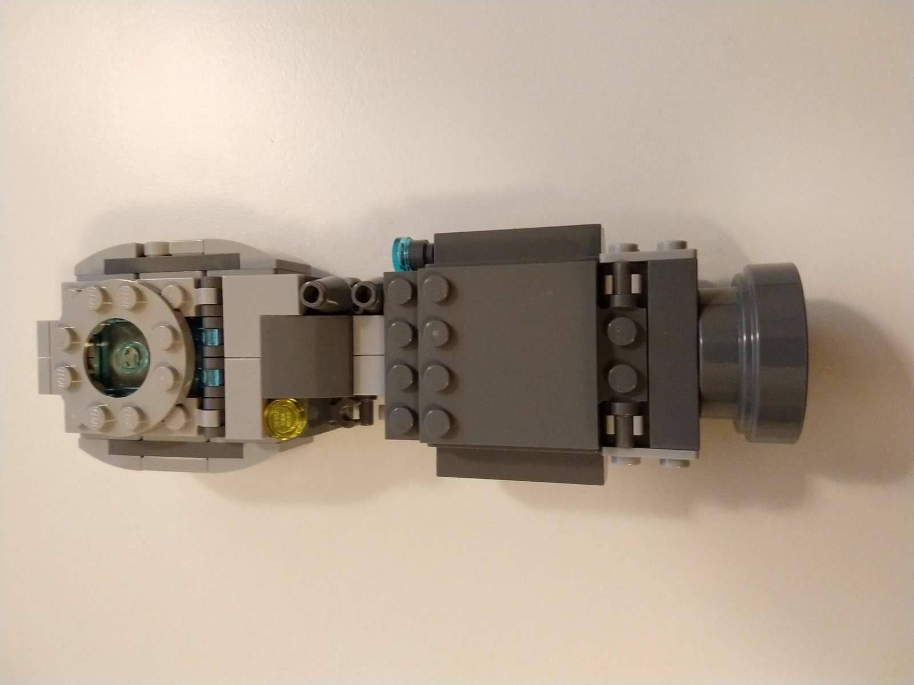
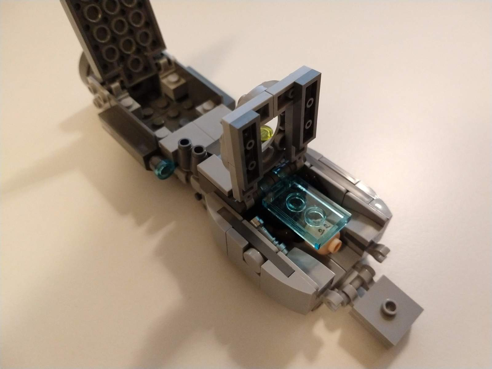
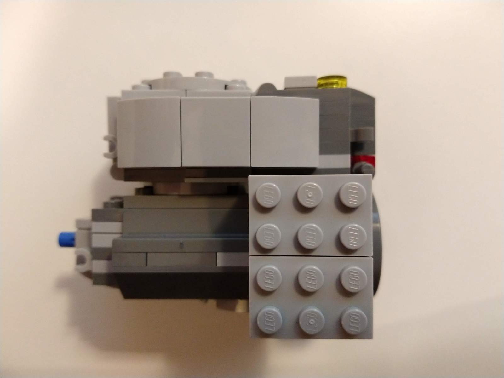
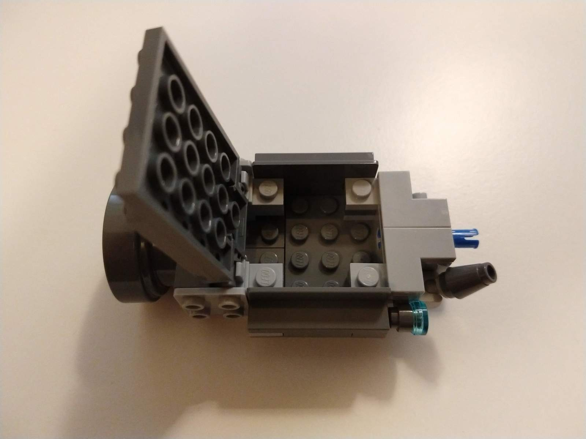
