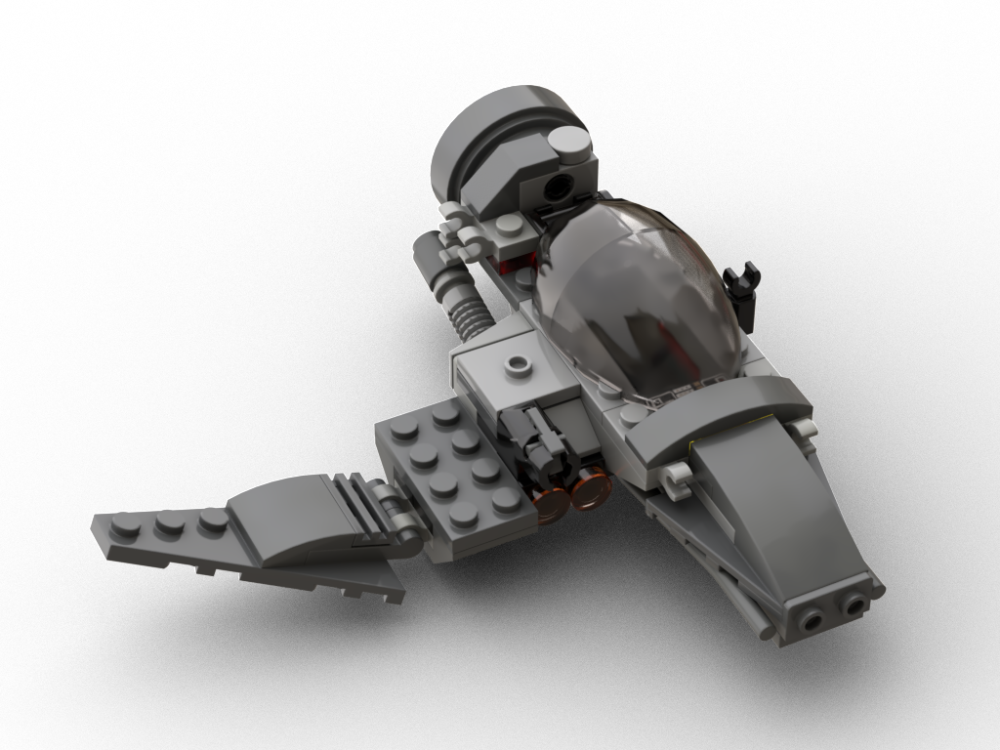
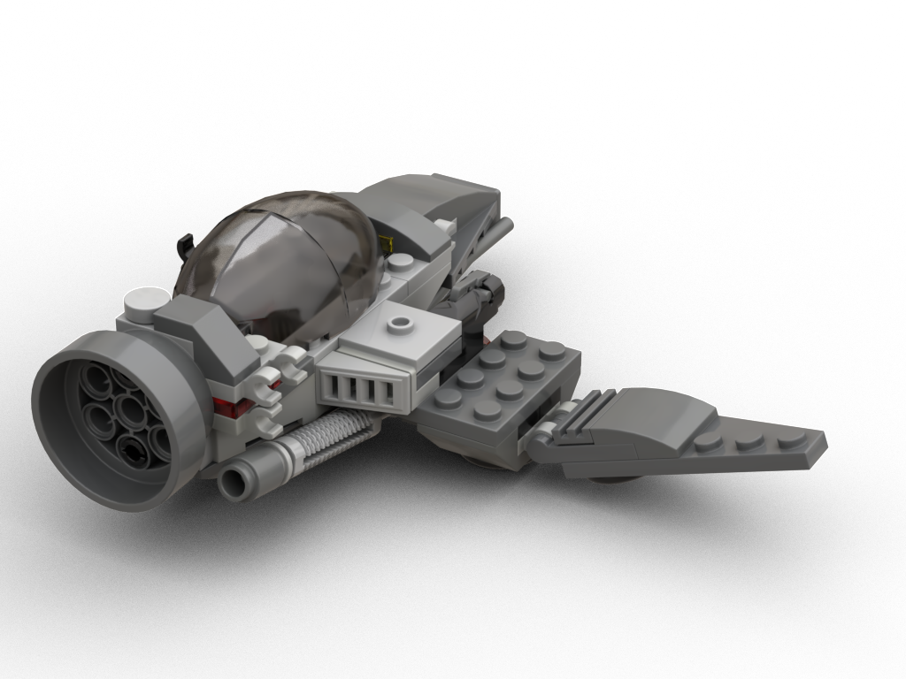
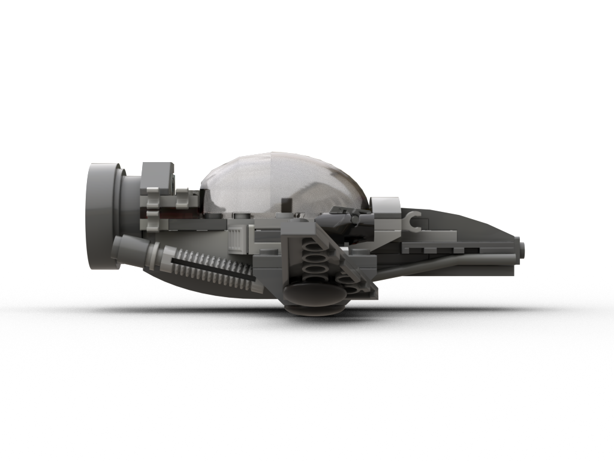
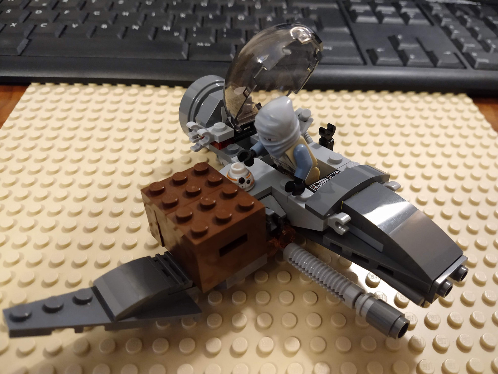
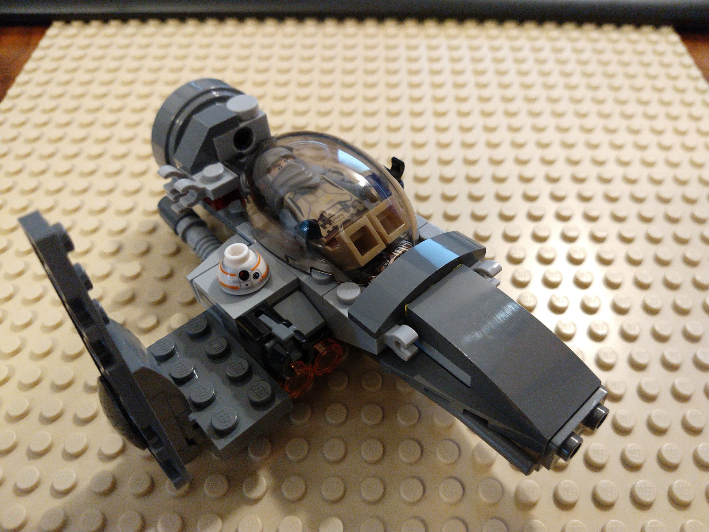
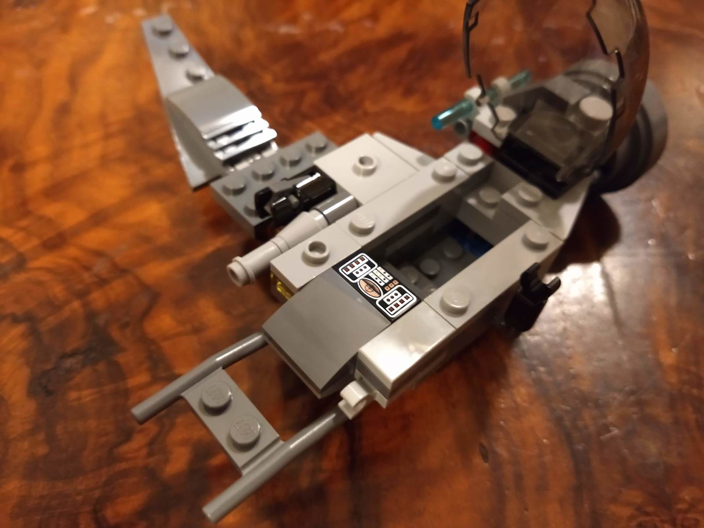
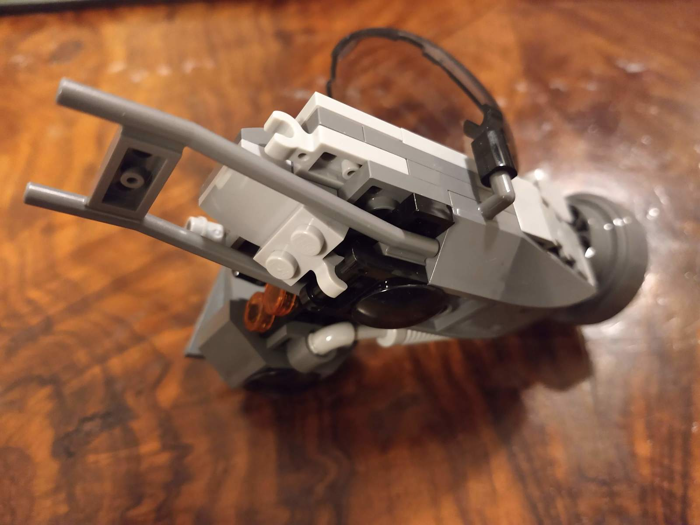
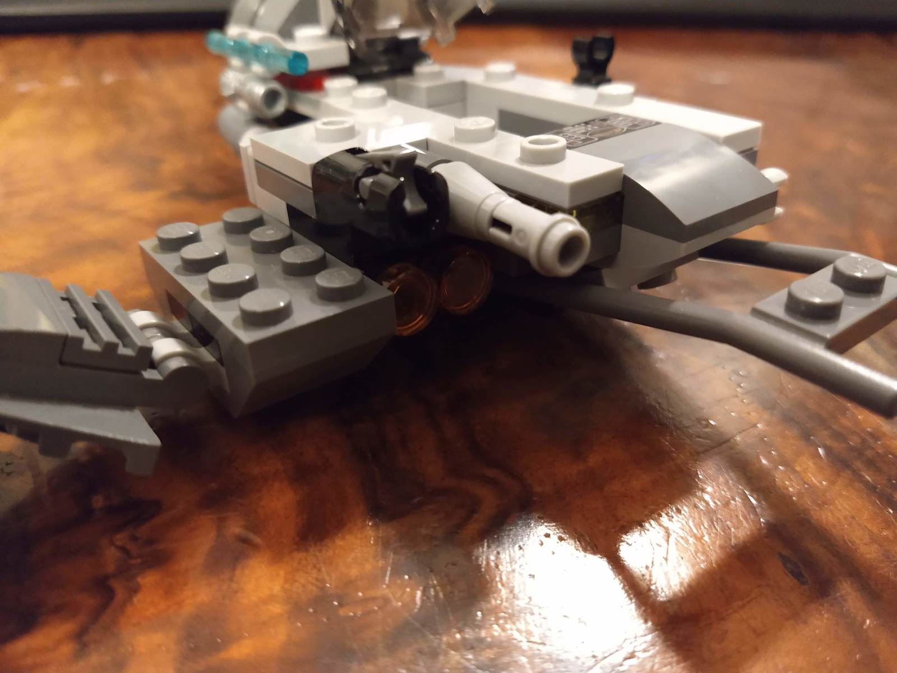
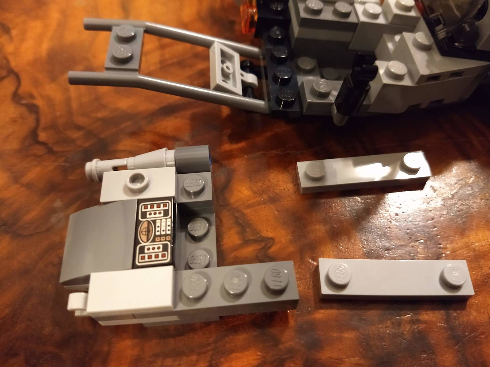
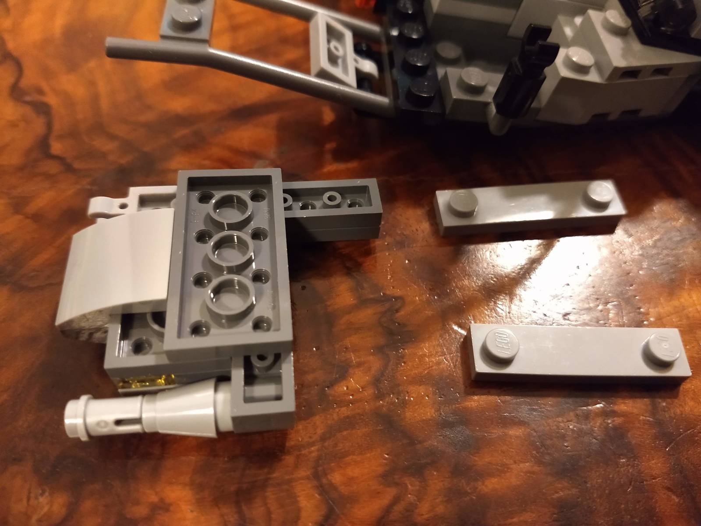

The Mosquito is a light scout and assault fighter, that is much valued by smugglers for its cargo lifting and modding capabilities.

[Instructions (includes part list)](the-mosquito-instructions.pdf)

## Rendered images

## Features

* Pilot cockpit with controls, water, food and energy supply (blue, green and red transparent plates inside the cockpit)
* Adjustable wing, can also be detached
* Launcher / light gun and reconnaissance optics (or laser weapons)
* Large side 4x2 port for small to medium sized cargo
* Docking port for droids or connector for bricks that should not be attached too firmly
* Various handles to store minifigure gear or custom fitted cargo containers
* Rotatable handle on the left side
* Can stand upright on its rear engine
* Exhaust pipe can be rotated and interpreted to also allow mid-flight refuel
* Rear engine could be detached, allowing to dock a custom cabin or cargo pod

## Meta

I built the first version in summer 2017. It started as a scooter, boat or submarine, inspired by motorcycles with sidecars.
Since then, I iterated multiple times, improving stability, connection points, pilot space and aesthetics.
It is still ones of my favorites due to the interesting asymmetry, small form factor and plenty of movable parts.

* The part base are various Lego Star Wars sets
* Time needed to digitalize the model using [BrickLink Studio](https://studio.bricklink.com/v2/build/studio.page): ~80 minutes (first time doing this, now I am more comfortable finding parts 😃)
* Dimensions: 12x12x5cm with extended wing, ~58g, 74 parts, 58 distinct parts

## 2020 Edition

End of 2020 I iterated on the model again, minimizing the massive "nose" and making the front scaffold "strings" more prominent. The weapon assembly got another cannon.

