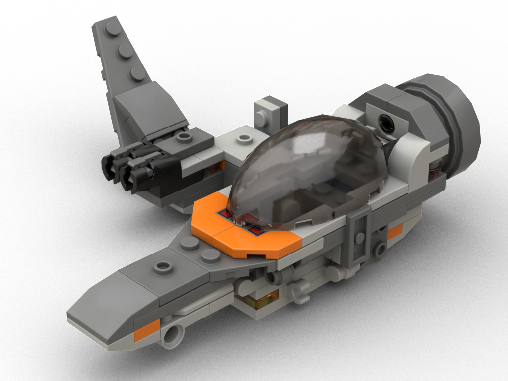
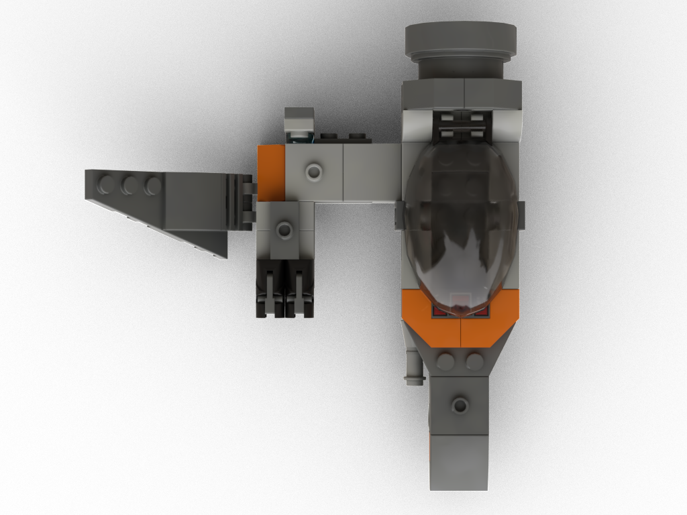
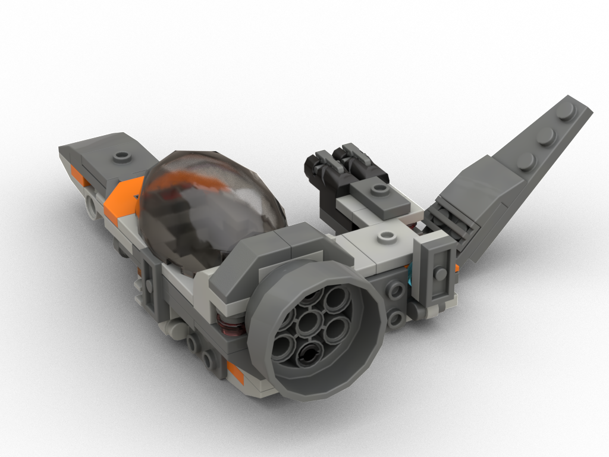
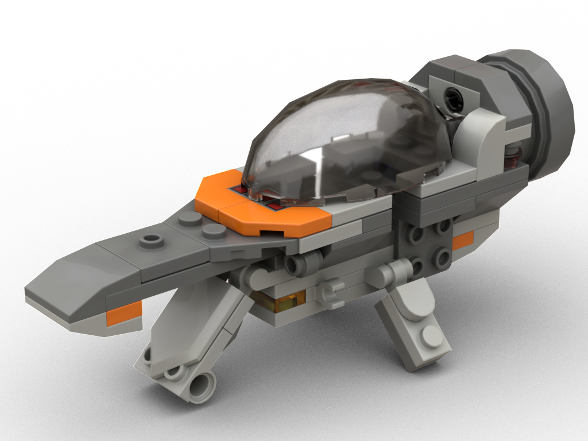
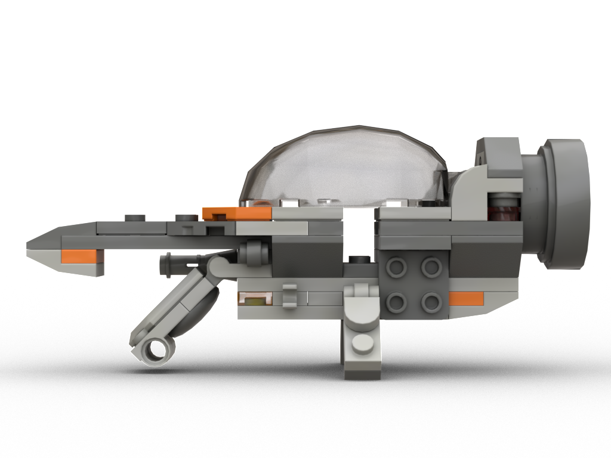

<!--

[Instructions (includes part list)](model-instructions.pdf)

-->

## Rendered images

## Features

* Minimal cockpit space
* Extendable pedestals
* Minifigure gear attachment point
* Bot docking port
* Side rack attachment studs (left side)
* Pin attachment point (right side), used for [Mosquito](../the-mosquito/) sidecar add-on

## Meta

* Original goal was to re-use a minimal version of the [Dagger](../the-dagger/) landing gear for a new ship
* The main ship then looked so similar to the Mosquito, I built a sidecar add-on to make it look like a Mosquito
* First model I digitalized in a long time, took some time to get into Bricklink Studio again
