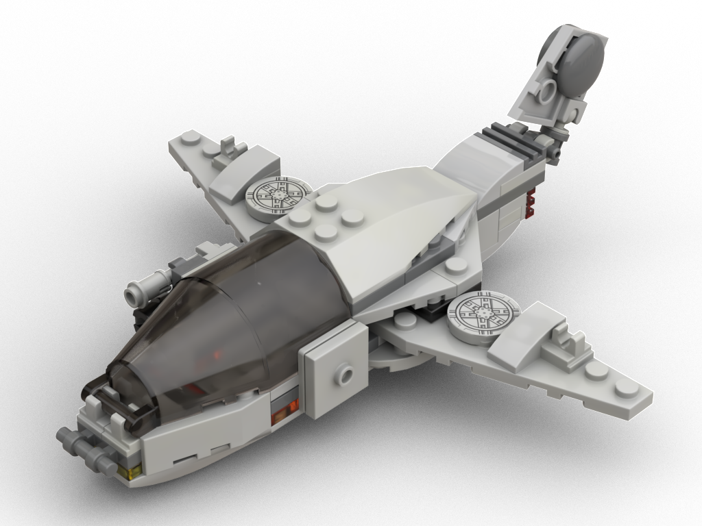
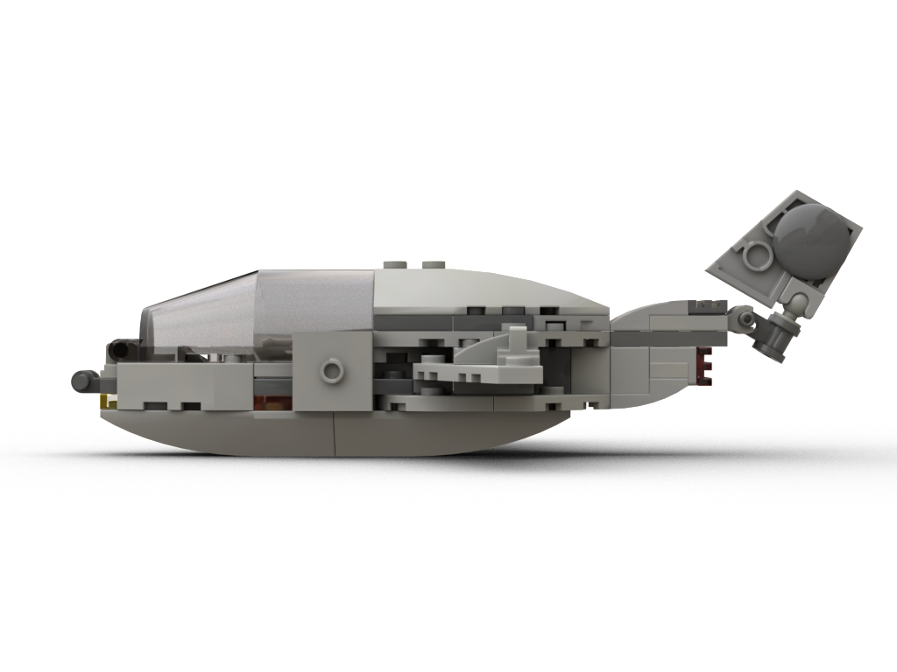
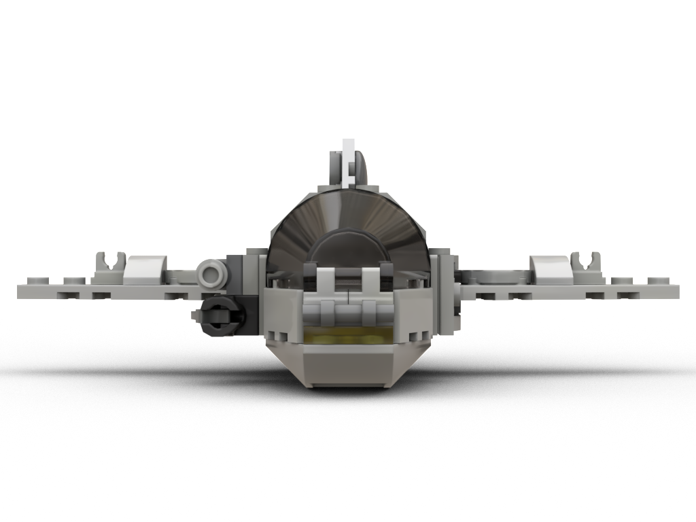
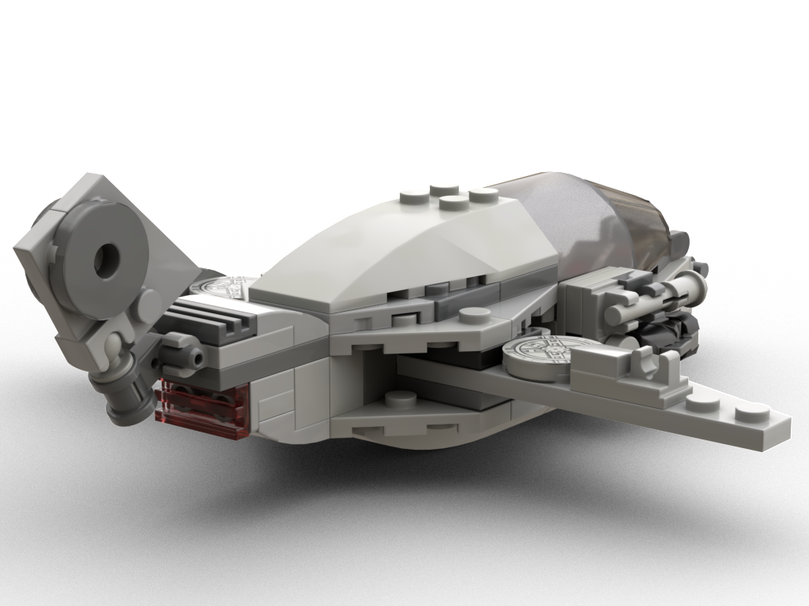
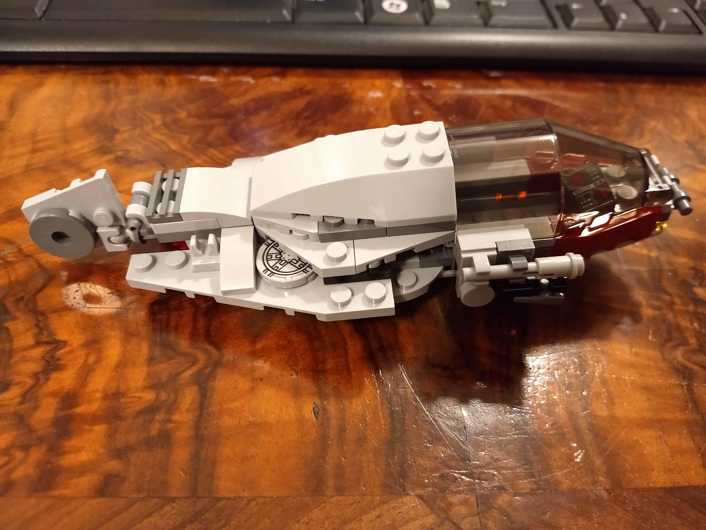

A light reconnaissance fighter.

[Instructions (includes part list)](the-swallow-instructions.pdf)

## Rendered images

## Features

* Foldable wings and adjustable rear
* Detachable engine part
* Light arms on the right side, bot docking port on the left side

## Meta

I wanted a ship with foldable wings, so I built one! ;)

* Dimensions: 14x16x6cm, 66g, 84 parts, 55 distinct parts

